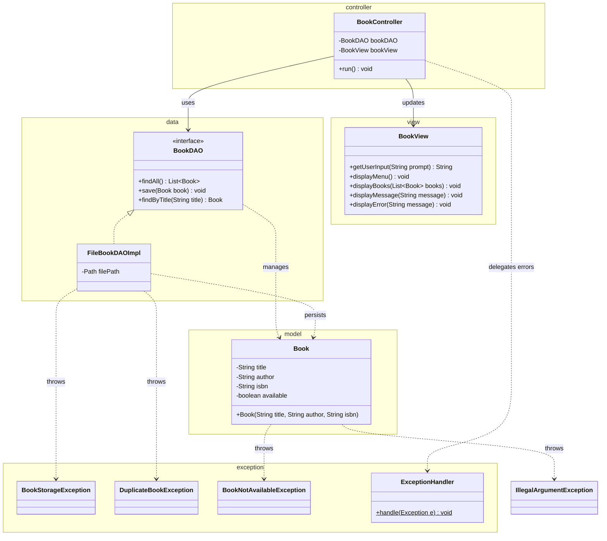

# Workshop: Library Book Management

## Class Diagram

## Checklist

- [x] Task 1: Create the `Book` class in the `model` package with validation for fields and ISBN format
- [x] Task 2: Define `BookStorageException`, `DuplicateBookException`, and `BookNotAvailableException` in the `exception` package
- [x] Task 3: Implement `BookDAO` and `FileBookDAOImpl` in the `data` package
- [x] Task 4: Create the `BookView` and `BookController` following the MVC pattern
- [x] Task 5: Explain the MVC design pattern

See [Workshop_1_Library_Books.md](Workshop_1_Library_Books.md) for full instructions.
