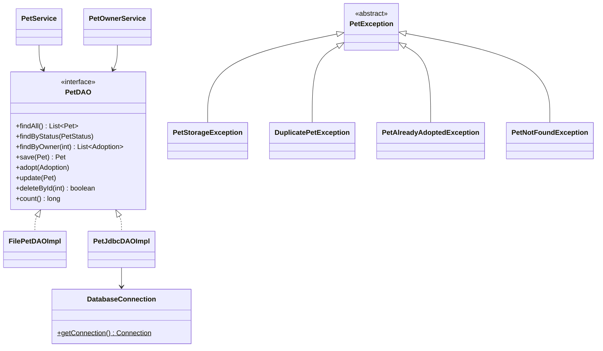

# Workshop: Pet Adoption System — the full clone

> **Step 10 of 10** — Difficulty **10/10** (2 hints provided)
> Focus: **everything** — the complete Event-Manager architecture (model, enums, streams, file+JDBC DAOs, service, view, controller, util, SQL, exceptions) assembled from a single class diagram.

## The 10-step path to a full Event-Manager-style application

| Step | Branch | Scenario | Event-Manager part(s) | Difficulty |
|:---:|---|:---:|---|:---:|
| 1 | workshop-1-library-books | Library Book Management | `model` + validation | 1/10 |
| 2 | workshop-2-employee-mgmt | Employee Management | `ui` + `controller` (MVC) | 2/10 |
| 3 | workshop-3-product-inventory | Product Inventory | `dao` + `daoImpl` (file) | 3/10 |
| 4 | workshop-4-student-grades | Student Grades | `exception` + ExceptionHandler | 4/10 |
| 5 | workshop-5-task-manager | Task Manager | enum + streams + 2 entities | 5/10 |
| 6 | workshop-6-recipe-manager | Recipe Manager | `service` layer | 6/10 |
| 7 | workshop-7-vehicle-registration | Vehicle Registration | `util` + SQL schema + first JDBC DAO | 7/10 |
| 8 | workshop-8-movie-collection | Movie Collection | full JDBC `daoImpl` CRUD | 8/10 |
| 9 | workshop-9-bank-account | Bank Account | relations + transactions + base exception | 9/10 |
| **10** | **workshop-10-pet-adoption** | **Pet Adoption** | **everything (full clone)** | **10/10** |

Each branch keeps its own scenario, adds a little more of the architecture, and gives **fewer hints**. This is the final step — you build the whole app from one diagram.

## This step — the entire architecture



> **Only docs are written on this branch — everything else (pom, schema, models, DAOs, services, view, controller, util, exceptions) is yours to build from the worksheet.**

## Checklist

- [ ] `Pet`, `PetStatus`, `PetOwner`, `Adoption` with validation
- [ ] Exception family from abstract `PetException` + `ExceptionHandler`
- [ ] `PetDAO` interface — full feature set
- [ ] `FilePetDAOImpl` AND `PetJdbcDAOImpl`, swapped in `Main`
- [ ] `PetService` + `PetOwnerService` own every rule
- [ ] `pet_adoption.sql` — 3 tables, FKs, unique owner email
- [ ] `adopt` is one transaction (rollback proves itself)
- [ ] Streams used for `listAvailable` / per-owner queries
- [ ] Every error → handler → friendly message
- [ ] All 7 scenarios pass with both DAOs, survives restart

## Running

Requires a running local MySQL + your schema applied once. Then:

```bash
mvn clean compile
mvn exec:java -Dexec.mainClass="se.lexicon.Main"
```

See [Workshop_10_Pet_Adoption.md](Workshop_10_Pet_Adoption.md) for the full class diagram, feature list, schema requirements and test scenarios.