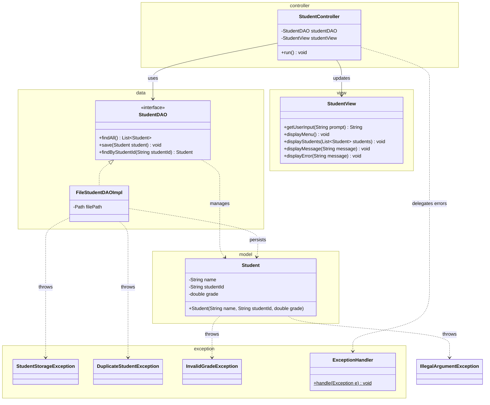

# Workshop: Student Grade Tracker

## Class Diagram

## Checklist

- [ ] Task 1: `Student` model with validation + studentId regex (`^S\d{6}$`)
- [ ] Task 2: Custom checked exceptions (`StudentStorageException`, `DuplicateStudentException`, `InvalidGradeException`)
- [ ] Task 3: DAO layer (`StudentDAO`, `FileStudentDAOImpl`) - no console printing
- [ ] Task 4: View & Controller (MVC), try-catch loop in controller
- [ ] Task 5: Explain the MVC design pattern

See [Workshop_4_Student_Grades.md](Workshop_4_Student_Grades.md) for full instructions.
