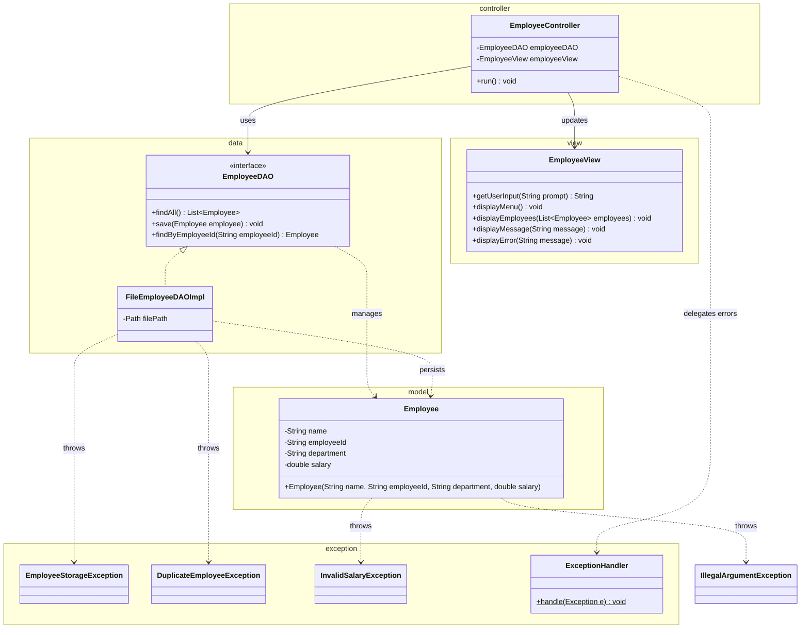

# Workshop: Employee Management System

## Class Diagram

## Checklist

- [ ] Task 1: Create the `Employee` class in the `model` package with validation for fields, name, employee ID, and salary
- [ ] Task 2: Define `EmployeeStorageException`, `DuplicateEmployeeException`, and `InvalidSalaryException` in the `exception` package
- [ ] Task 3: Implement `EmployeeDAO` and `FileEmployeeDAOImpl` in the `data` package
- [ ] Task 4: Create the `EmployeeView` and `EmployeeController` following the MVC pattern
- [ ] Task 5: Explain the MVC design pattern

See [Workshop_2_Employee_Management.md](Workshop_2_Employee_Management.md) for full instructions.
