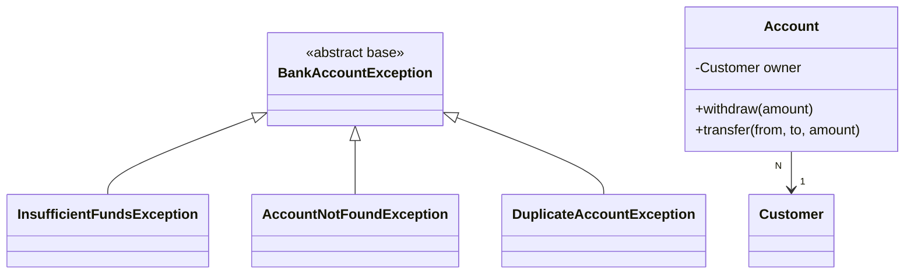

# Workshop: Bank Account — relations + transactions + base exception

> **Step 9 of 10** — Difficulty **9/10** (3 hints provided)
> Focus: FK relations + JDBC transactions + a unified base exception — the machinery behind `Event` ↔ `Participant` ↔ `Invitation` in the Event Manager app.

## The 10-step path to a full Event-Manager-style application

| Step | Branch | Scenario | Event-Manager part(s) | Difficulty |
|:---:|---|:---:|---|:---:|
| 1 | workshop-1-library-books | Library Book Management | `model` + validation | 1/10 |
| 2 | workshop-2-employee-mgmt | Employee Management | `ui` + `controller` (MVC) | 2/10 |
| 3 | workshop-3-product-inventory | Product Inventory | `dao` + `daoImpl` (file) | 3/10 |
| 4 | workshop-4-student-grades | Student Grades | `exception` + ExceptionHandler | 4/10 |
| 5 | workshop-5-task-manager | Task Manager | enum + streams + 2 entities | 5/10 |
| 6 | workshop-6-recipe-manager | Recipe Manager | `service` layer | 6/10 |
| 7 | workshop-7-vehicle-registration | Vehicle Registration | `util` + SQL schema + first JDBC DAO | 7/10 |
| 8 | workshop-8-movie-collection | Movie Collection | full JDBC `daoImpl` CRUD | 8/10 |
| **9** | **workshop-9-bank-account** | **Bank Account** | **relations + transactions + base exception** | **9/10** |
| 10 | workshop-10-pet-adoption | Pet Adoption | everything (full clone) | 10/10 |

Each branch keeps its own scenario, adds a little more of the architecture, and gives **fewer hints**.

## This step — the machine that runs on money



> **Only docs are written on this branch — schema, models, DAOs, the transfer transaction, service, view and controller are yours to build.**

## Checklist

- [ ] Task 1: `bank_db` schema — `customer` + `account` with `FOREIGN KEY`
- [ ] Task 2: `BankAccountException` base + 3 subtypes; model `deposit`/`withdraw`
- [ ] Task 3: DAOs resolve owner via `JOIN` (one `ResultSet` pass)
- [ ] Task 4: `transfer` — one connection, `setAutoCommit(false)`, commit + rollback
- [ ] Task 5: menu + handler catching the base type
- [ ] Task 6: explain why a single transaction (and test it with a crashed MySQL)

## Running

Requires a running local MySQL + the schema applied once. Then:

```bash
mvn clean compile
mvn exec:java -Dexec.mainClass="se.lexicon.Main"
```

See [Workshop_9_Bank_Account.md](Workshop_9_Bank_Account.md) for the full instructions, SQL, the `transfer` transaction code and test scenarios.