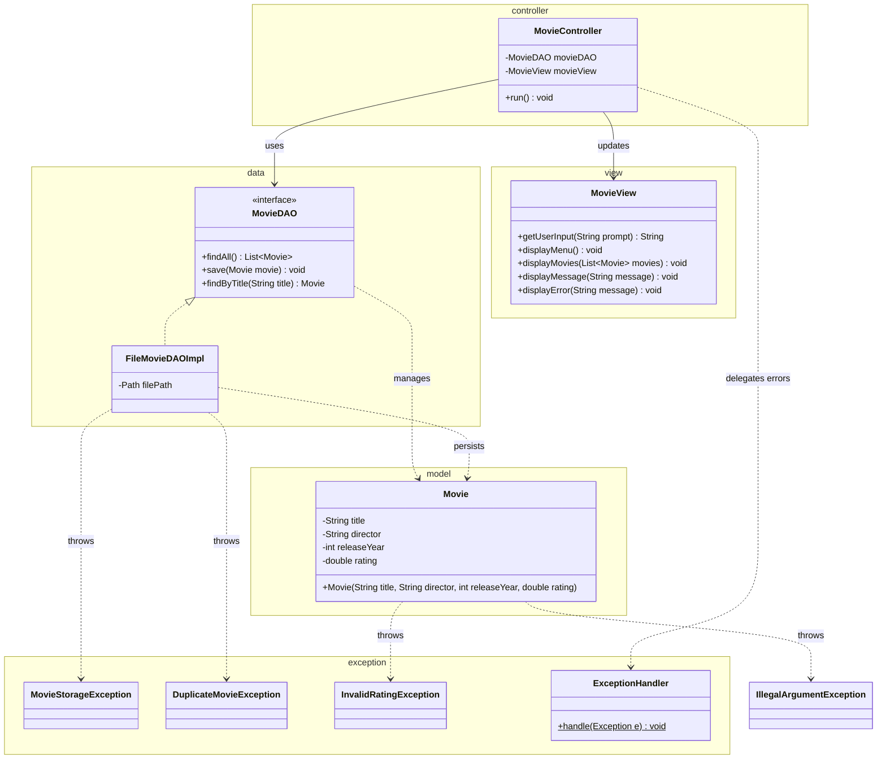

# Workshop: Movie Collection Manager

## Class Diagram

## Checklist

- [ ] Task 1: Create the `Movie` class in the `model` package with validation (title, director, releaseYear, rating)
- [ ] Task 2: Define `MovieStorageException`, `DuplicateMovieException`, and `InvalidRatingException` in the `exception` package
- [ ] Task 3: Implement `MovieDAO` and `FileMovieDAOImpl` in the `data` package
- [ ] Task 4: Create the `MovieView` and `MovieController` following the MVC pattern
- [ ] Task 5: Explain the MVC design pattern

See [Workshop_8_Movie_Collection.md](Workshop_8_Movie_Collection.md) for full instructions.
