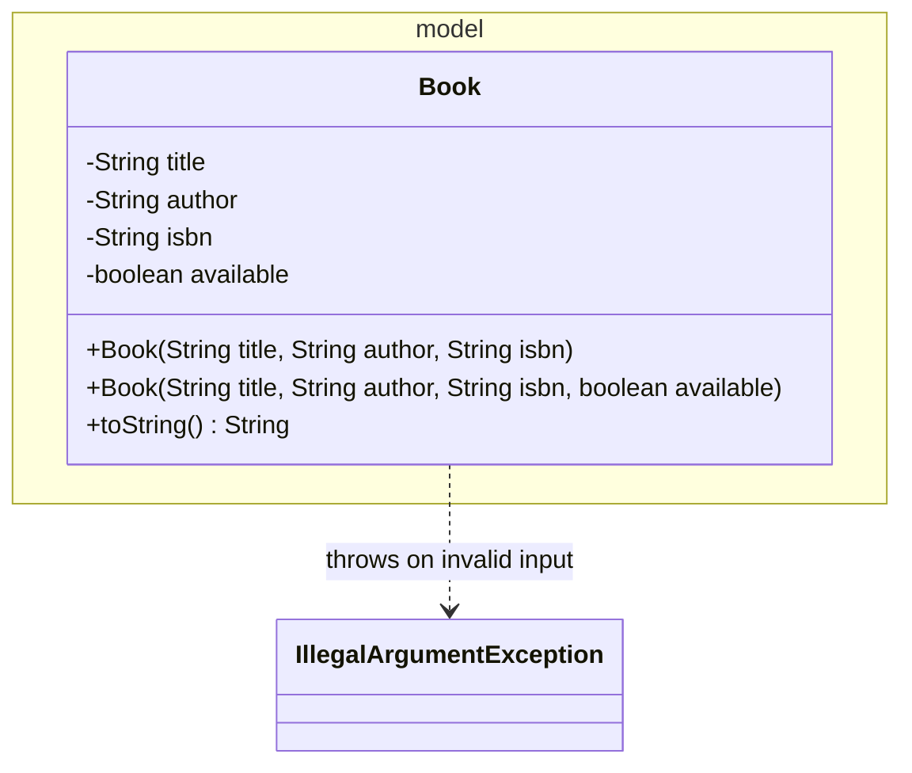

# Workshop: Library Book Management

> **Step 1 of 10** — Difficulty **1/10** (12 hints provided)
> Focus: the `model` layer (encapsulation + validation) — like `se.lexicon.model` in the Event Manager app.

## The 10-step path to a full Event-Manager-style application

| Step | Branch | Scenario | Event-Manager part(s) | Difficulty |
|:---:|---|:---:|---|:---:|
| **1** | **workshop-1-library-books** | **Library Book Management** | **`model` + validation** | **1/10** |
| 2 | workshop-2-employee-mgmt | Employee Management | `ui` + `controller` (MVC) | 2/10 |
| 3 | workshop-3-product-inventory | Product Inventory | `dao` + `daoImpl` (file) | 3/10 |
| 4 | workshop-4-student-grades | Student Grades | `exception` + ExceptionHandler | 4/10 |
| 5 | workshop-5-task-manager | Task Manager | enum + streams + 2 entities | 5/10 |
| 6 | workshop-6-recipe-manager | Recipe Manager | `service` layer | 6/10 |
| 7 | workshop-7-vehicle-registration | Vehicle Registration | `utility` + SQL schema + first JDBC DAO | 7/10 |
| 8 | workshop-8-movie-collection | Movie Collection | full JDBC `daoImpl` CRUD | 8/10 |
| 9 | workshop-9-bank-account | Bank Account | relations + transactions + base exception | 9/10 |
| 10 | workshop-10-pet-adoption | Pet Adoption | everything (full clone) | 10/10 |

Each branch keeps its own scenario, adds a little more of the architecture, and gives **fewer hints**.

## This step — the Model



## Checklist

- [ ] Task 1: Create the `Book` class in the `model` package (private fields + getters)
- [ ] Task 2: Validate title/author (not blank) and ISBN (`^\d{13}$`) → `IllegalArgumentException`
- [ ] Task 3: `available` defaults to `true`; readable `toString()`
- [ ] Task 4: Explain why unchecked exceptions suit model validation

## Running

```bash
mvn clean compile
mvn exec:java -Dexec.mainClass="se.lexicon.Main"
```

See [Workshop_1_Library_Books.md](Workshop_1_Library_Books.md) for the full instructions, flowcharts and test scenarios.