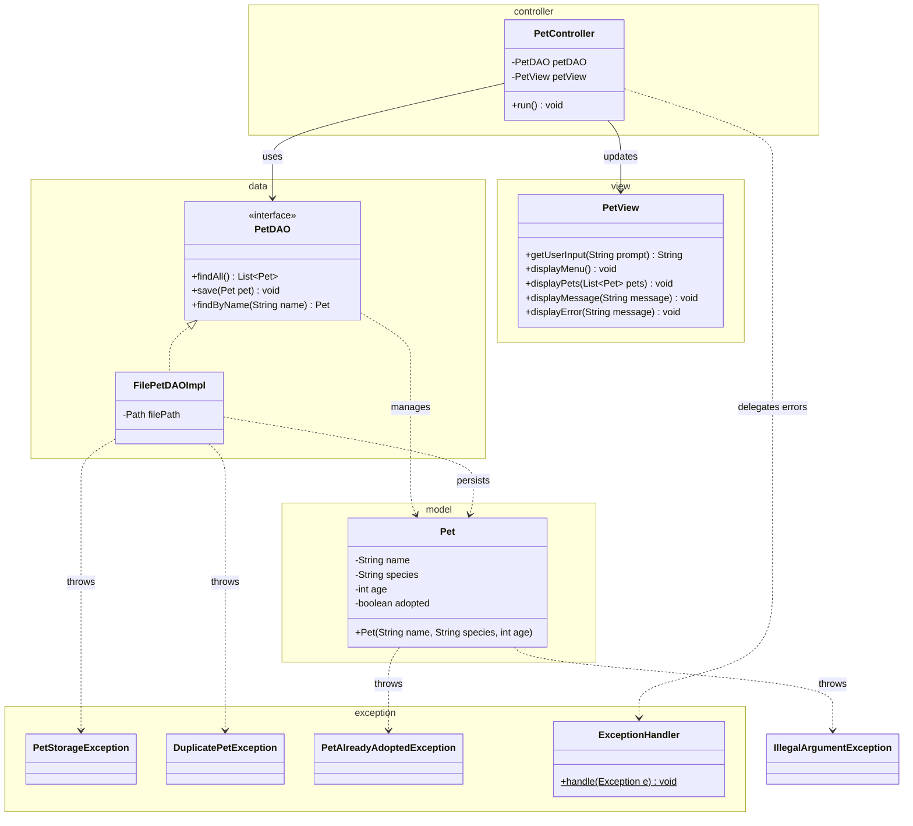

# Workshop: Pet Adoption System

## Class Diagram

## Checklist

- [x] Task 1: Create the `Pet` class in the `model` package with validation (name, species, age, adopted)
- [x] Task 2: Define `PetStorageException`, `DuplicatePetException`, and `PetAlreadyAdoptedException` in the `exception` package
- [x] Task 3: Implement `PetDAO` and `FilePetDAOImpl` in the `data` package
- [x] Task 4: Create the `PetView` and `PetController` following the MVC pattern
- [x] Task 5: Explain the MVC design pattern

See [Workshop_10_Pet_Adoption.md](Workshop_10_Pet_Adoption.md) for full instructions.
