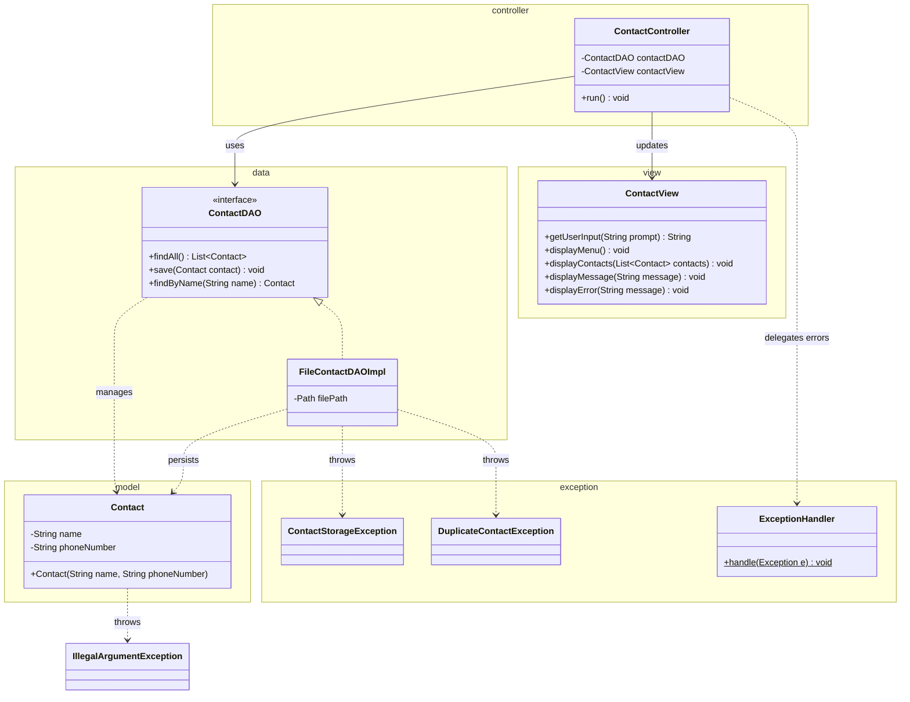



# Exception and Files - README Checklist

> Checklist of topics to cover in the README, based on `Exception_Preseentation.md` and `Exception_Workshop.md`.

## Project Overview
- [x] Project title and short description
- [x] Purpose of the repository (contains presentation + workshop materials)
- [x] Link to [`Exception_Preseentation.md`](Exception_Preseentation.md) (theory/slides)
- [x] Link to [`Exception_Workshop.md`](Exception_Workshop.md) (hands-on tasks)

## Theory Topics (from the Presentation)
- [ ] Introduction to exceptions (what, why, advantages)
- [ ] Types of exceptions: Checked, Unchecked, Errors
- [ ] Exception hierarchy (`Throwable`, `Exception`, `RuntimeException`, `Error`)
- [ ] Handling exceptions: `try`, `catch`, `finally`
- [ ] `try-with-resources` and automatic resource closing
- [ ] Execution flow summary (try -> catch -> finally)
- [ ] `throw` vs `throws` and when to use each
- [ ] Custom (user-defined) exceptions and why to use them

## Workshop: Contact App (from the Workshop)
- [ ] Workshop objective (manage contacts stored in a text file)
- [ ] Learning goals (validation, custom exceptions, try-with-resources, centralized handler)
- [ ] Prerequisites & setup (Maven project: `se.lexicon` / `contact-app-workshop`)
- [ ] Git init, push to GitHub/GitLab, share link with instructor
- [x] Class diagram / package structure (model, data, view, controller, exception)

- [ ] Task 1: `Contact` model with validation + phone regex (`^\d{10}$`)
- [ ] Task 2: Custom checked exceptions (`ContactStorageException`, `DuplicateContactException`)
- [ ] Task 3: DAO layer (`ContactDAO`, `FileContactDAOImpl`) - no console printing
- [ ] Task 4: View & Controller (MVC), try-catch loop in controller
- [ ] Task 5: Explain the MVC design pattern

## Submission & Grading
- [ ] How to run the application
- [ ] Where to submit (repository link)
- [ ] Checklist of completed tasks

## Miscellaneous
- [ ] Built with / Tech stack (Java, Maven)
- [ ] License (optional)
- [ ] Authors / instructor name (optional)
