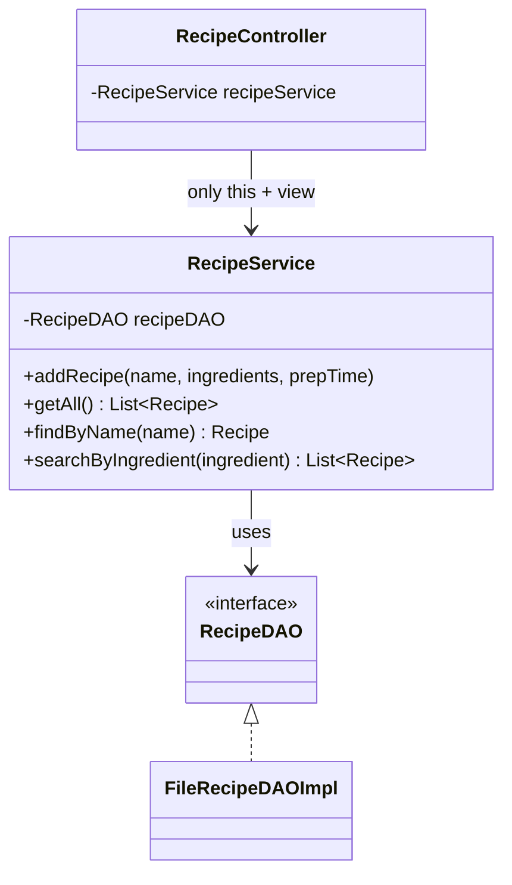

# Workshop: Recipe Manager

> **Step 6 of 10** — Difficulty **6/10** (7 hints provided)
> Focus: the `service` layer — business rules in `RecipeService`, slim controller — the exact `ServiceManager` pattern in the Event Manager app.

## The 10-step path to a full Event-Manager-style application

| Step | Branch | Scenario | Event-Manager part(s) | Difficulty |
|:---:|---|:---:|---|:---:|
| 1 | workshop-1-library-books | Library Book Management | `model` + validation | 1/10 |
| 2 | workshop-2-employee-mgmt | Employee Management | `ui` + `controller` (MVC) | 2/10 |
| 3 | workshop-3-product-inventory | Product Inventory | `dao` + `daoImpl` (file) | 3/10 |
| 4 | workshop-4-student-grades | Student Grades | `exception` + ExceptionHandler | 4/10 |
| 5 | workshop-5-task-manager | Task Manager | enum + streams + 2 entities | 5/10 |
| **6** | **workshop-6-recipe-manager** | **Recipe Manager** | **`service` layer** | **6/10** |
| 7 | workshop-7-vehicle-registration | Vehicle Registration | `utility` + SQL schema + first JDBC DAO | 7/10 |
| 8 | workshop-8-movie-collection | Movie Collection | full JDBC `daoImpl` CRUD | 8/10 |
| 9 | workshop-9-bank-account | Bank Account | relations + transactions + base exception | 9/10 |
| 10 | workshop-10-pet-adoption | Pet Adoption | everything (full clone) | 10/10 |

Each branch keeps its own scenario, adds a little more of the architecture, and gives **fewer hints**.

## This step — the service layer



## Checklist

- [ ] Task 1: `Recipe` with `List<String> ingredients` + validation
- [ ] Task 2: DAO file format handles ingredient lists
- [ ] Task 3: `RecipeService` owns all business rules + exceptions
- [ ] Task 4: Controller slimmed — calls only the service
- [ ] Task 5: `Main` wires dao → service → controller
- [ ] Task 6: Explain which files change if the DAO becomes JDBC

## Running

```bash
mvn clean compile
mvn exec:java -Dexec.mainClass="se.lexicon.Main"
```

See [Workshop_6_Recipe_Manager.md](Workshop_6_Recipe_Manager.md) for the full instructions, flowcharts and test scenarios.