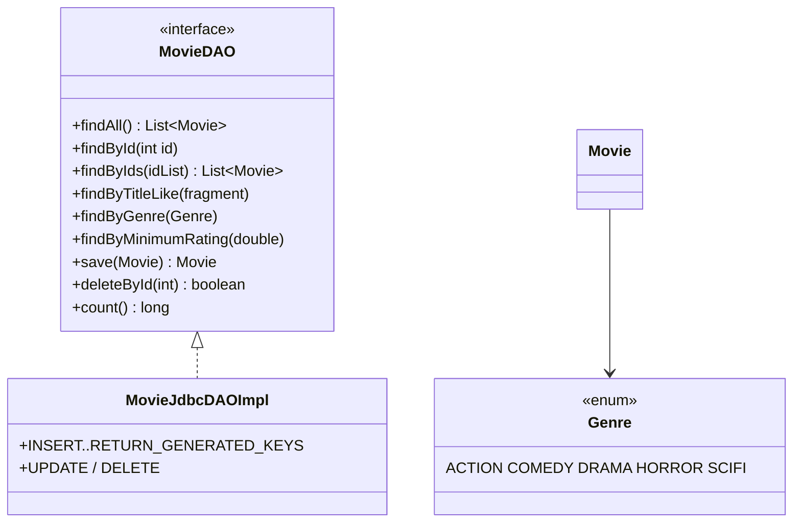

# Workshop: Movie Collection — full JDBC CRUD

> **Step 8 of 10** — Difficulty **8/10** (5 hints provided)
> Focus: full JDBC `daoImpl` **CRUD** — id-based PK, `save` with generated keys, `update`, `deleteById`, parameterized queries — the complete `ParticipantDAO`-style interface of the Event Manager app.

## The 10-step path to a full Event-Manager-style application

| Step | Branch | Scenario | Event-Manager part(s) | Difficulty |
|:---:|---|:---:|---|:---:|
| 1 | workshop-1-library-books | Library Book Management | `model` + validation | 1/10 |
| 2 | workshop-2-employee-mgmt | Employee Management | `ui` + `controller` (MVC) | 2/10 |
| 3 | workshop-3-product-inventory | Product Inventory | `dao` + `daoImpl` (file) | 3/10 |
| 4 | workshop-4-student-grades | Student Grades | `exception` + ExceptionHandler | 4/10 |
| 5 | workshop-5-task-manager | Task Manager | enum + streams + 2 entities | 5/10 |
| 6 | workshop-6-recipe-manager | Recipe Manager | `service` layer | 6/10 |
| 7 | workshop-7-vehicle-registration | Vehicle Registration | `util` + SQL schema + first JDBC DAO | 7/10 |
| **8** | **workshop-8-movie-collection** | **Movie Collection** | **full JDBC `daoImpl` CRUD** | **8/10** |
| 9 | workshop-9-bank-account | Bank Account | relations + transactions + base exception | 9/10 |
| 10 | workshop-10-pet-adoption | Pet Adoption | everything (full clone) | 10/10 |

Each branch keeps its own scenario, adds a little more of the architecture, and gives **fewer hints**.

## This step — CRUD, complete



> **Only docs are written on this branch — schema, model, DAO, service, view and controller are yours to build.**

## Checklist

- [ ] Task 1: `Genre` enum + `Movie` (id starts at 0)
- [ ] Task 2: `movie_db` schema applied
- [ ] Task 3: `save` returns the movie with generated `id`
- [ ] Task 3: queries — by id, ids, title-like, genre, min rating
- [ ] Task 3: `update`, `deleteById`, `count`
- [ ] Task 4: service rules (duplicate + not-found) — SQL stays in the DAO
- [ ] Task 5: menu with Genre picker
- [ ] Task 6: explain the double duplicate-check

## Running

Requires a running local MySQL + the schema applied once. Then:

```bash
mvn clean compile
mvn exec:java -Dexec.mainClass="se.lexicon.Main"
```

See [Workshop_8_Movie_Collection.md](Workshop_8_Movie_Collection.md) for the full instructions, JDBC code patterns and test scenarios.