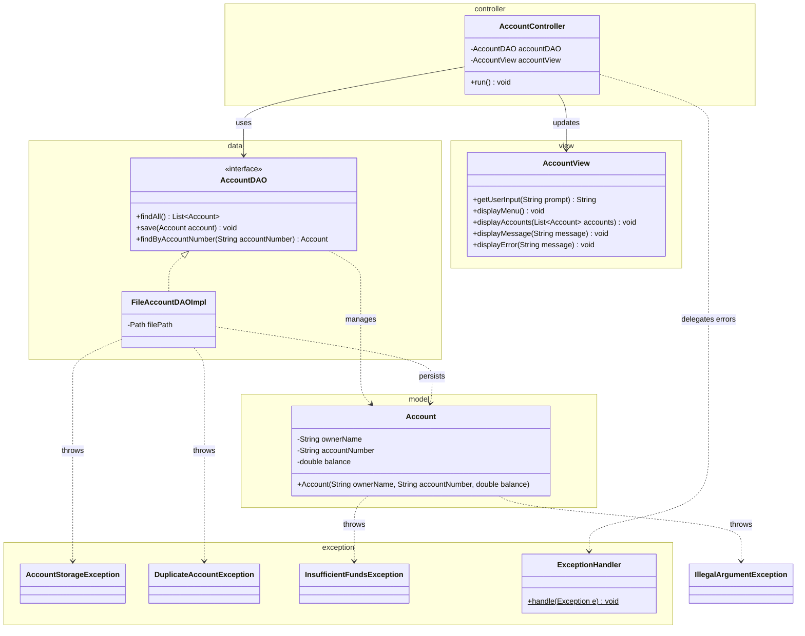

# Workshop: Bank Account Manager

## Class Diagram

## Checklist

- [ ] Task 1: Create the `Account` class in the `model` package with validation (ownerName, balance, accountNumber)
- [ ] Task 2: Define `AccountStorageException`, `DuplicateAccountException`, and `InsufficientFundsException` in the `exception` package
- [ ] Task 3: Implement `AccountDAO` and `FileAccountDAOImpl` in the `data` package
- [ ] Task 4: Create the `AccountView` and `AccountController` following the MVC pattern
- [ ] Task 5: Explain the MVC design pattern

See [Workshop_9_Bank_Account.md](Workshop_9_Bank_Account.md) for full instructions.
