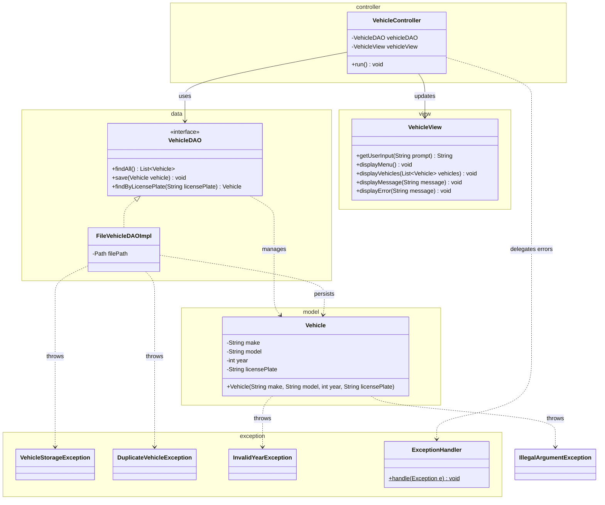

# Workshop: Vehicle Registration System

## Class Diagram

## Checklist

- [x] Task 1: Create the `Vehicle` class in the `model` package with validation (make, model, year, licensePlate)
- [x] Task 2: Define `VehicleStorageException`, `DuplicateVehicleException`, and `InvalidYearException` in the `exception` package
- [x] Task 3: Implement `VehicleDAO` and `FileVehicleDAOImpl` in the `data` package
- [x] Task 4: Create the `VehicleView` and `VehicleController` following the MVC pattern
- [x] Task 5: Explain the MVC design pattern

See [Workshop_7_Vehicle_Registration.md](Workshop_7_Vehicle_Registration.md) for full instructions.
