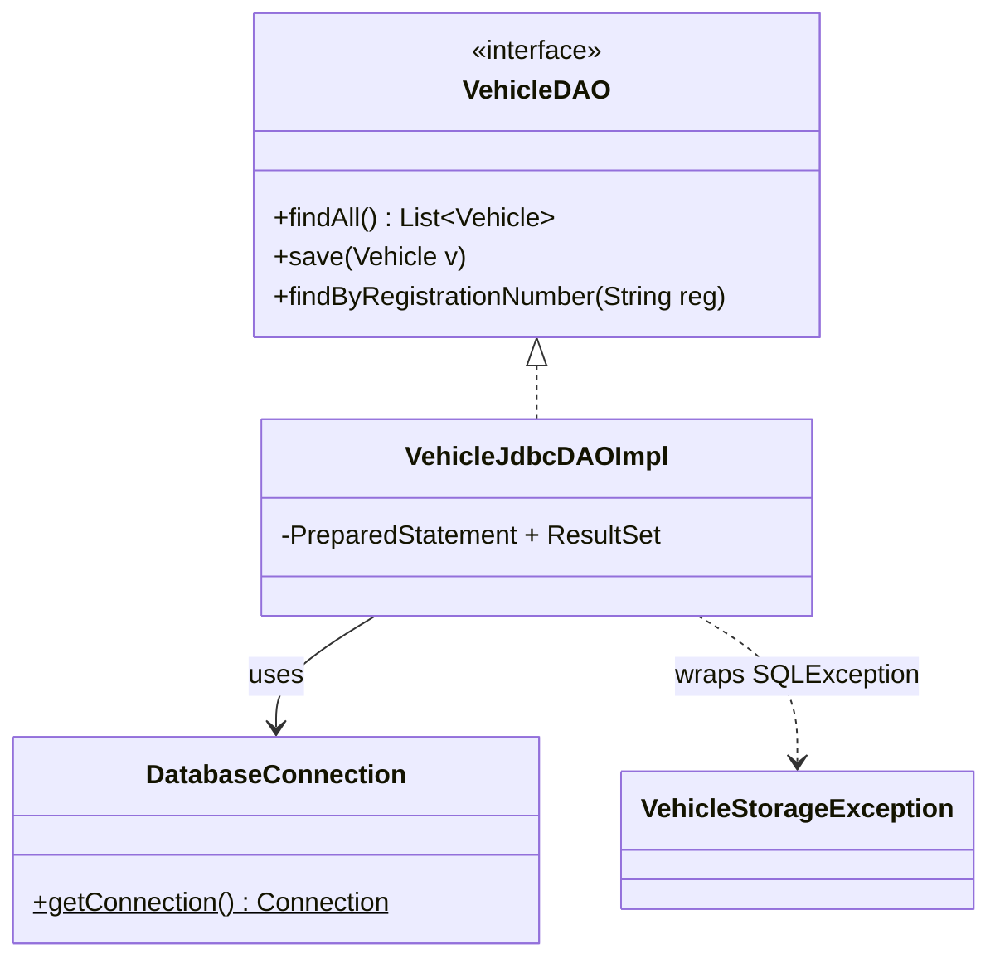

# Workshop: Vehicle Registration — your first JDBC DAO

> **Step 7 of 10** — Difficulty **7/10** (6 hints provided)
> Focus: `util` + SQL schema + first JDBC DAO — the `DatabaseConnection` / `SQL_database` mechanics of the Event Manager app. The app now persists to **MySQL** instead of text files.

## The 10-step path to a full Event-Manager-style application

| Step | Branch | Scenario | Event-Manager part(s) | Difficulty |
|:---:|---|:---:|---|:---:|
| 1 | workshop-1-library-books | Library Book Management | `model` + validation | 1/10 |
| 2 | workshop-2-employee-mgmt | Employee Management | `ui` + `controller` (MVC) | 2/10 |
| 3 | workshop-3-product-inventory | Product Inventory | `dao` + `daoImpl` (file) | 3/10 |
| 4 | workshop-4-student-grades | Student Grades | `exception` + ExceptionHandler | 4/10 |
| 5 | workshop-5-task-manager | Task Manager | enum + streams + 2 entities | 5/10 |
| 6 | workshop-6-recipe-manager | Recipe Manager | `service` layer | 6/10 |
| **7** | **workshop-7-vehicle-registration** | **Vehicle Registration** | **`util` + SQL schema + first JDBC DAO** | **7/10** |
| 8 | workshop-8-movie-collection | Movie Collection | full JDBC `daoImpl` CRUD | 8/10 |
| 9 | workshop-9-bank-account | Bank Account | relations + transactions + base exception | 9/10 |
| 10 | workshop-10-pet-adoption | Pet Adoption | everything (full clone) | 10/10 |

Each branch keeps its own scenario, adds a little more of the architecture, and gives **fewer hints**.

## This step — the jump to MySQL



## Checklist

- [ ] Task 1: `mysql-connector-j` dependency + `util.DatabaseConnection`
- [ ] Task 2: `SQL_database/vehicle_registration.sql` schema, table created
- [ ] Task 3: `Vehicle` model (plate regex, `modelYear >= 1886`)

> **Only docs are written on this branch — the schema file, model, DAO and utility are yours to build from this worksheet.**

- [ ] Task 4: `VehicleJdbcDAOImpl` — `findAll` / `save` / `findByRegistrationNumber`
- [ ] Task 5: `Main` swaps in `VehicleJdbcDAOImpl` (service/controller untouched)
- [ ] Task 6: Explain why `DatabaseConnection` + why wrap `SQLException`

## Running

Requires a running local MySQL + the schema applied once. Then:

```bash
mvn clean compile
mvn exec:java -Dexec.mainClass="se.lexicon.Main"
```

See [Workshop_7_Vehicle_Registration.md](Workshop_7_Vehicle_Registration.md) for the full instructions, SQL, JDBC code patterns and test scenarios.