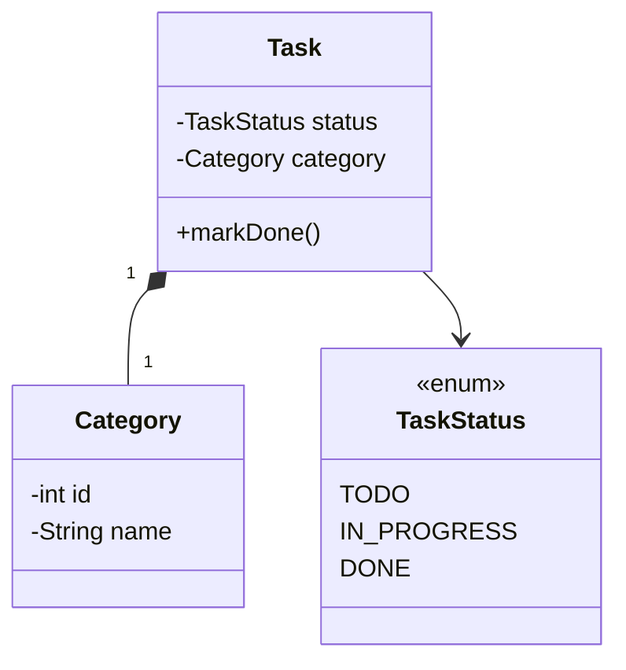

# Workshop: Task/Todo Manager

> **Step 5 of 10** — Difficulty **5/10** (8 hints provided)
> Focus: richer `model` — enums, a second entity (composition) and streams — like `InvitationStatus` + `Event`/`Participant`/`Invitation` in the Event Manager app.

## The 10-step path to a full Event-Manager-style application

| Step | Branch | Scenario | Event-Manager part(s) | Difficulty |
|:---:|---|:---:|---|:---:|
| 1 | workshop-1-library-books | Library Book Management | `model` + validation | 1/10 |
| 2 | workshop-2-employee-mgmt | Employee Management | `ui` + `controller` (MVC) | 2/10 |
| 3 | workshop-3-product-inventory | Product Inventory | `dao` + `daoImpl` (file) | 3/10 |
| 4 | workshop-4-student-grades | Student Grades | `exception` + ExceptionHandler | 4/10 |
| **5** | **workshop-5-task-manager** | **Task Manager** | **enum + streams + 2 entities** | **5/10** |
| 6 | workshop-6-recipe-manager | Recipe Manager | `service` layer | 6/10 |
| 7 | workshop-7-vehicle-registration | Vehicle Registration | `utility` + SQL schema + first JDBC DAO | 7/10 |
| 8 | workshop-8-movie-collection | Movie Collection | full JDBC `daoImpl` CRUD | 8/10 |
| 9 | workshop-9-bank-account | Bank Account | relations + transactions + base exception | 9/10 |
| 10 | workshop-10-pet-adoption | Pet Adoption | everything (full clone) | 10/10 |

Each branch keeps its own scenario, adds a little more of the architecture, and gives **fewer hints**.

## This step — enums, entities, streams



## Checklist

- [ ] Task 1: `TaskStatus` enum
- [ ] Task 2: `Category` + `Task` (composition; status via methods, not setters)
- [ ] Task 3: File persistence round-trips enum + category
- [ ] Task 4: Stream queries — filter, sort, `groupingBy`
- [ ] Task 5: Explain when an enum beats a boolean (and when it doesn't)

## Running

```bash
mvn clean compile
mvn exec:java -Dexec.mainClass="se.lexicon.Main"
```

See [Workshop_5_Task_Manager.md](Workshop_5_Task_Manager.md) for the full instructions, flowcharts and test scenarios.