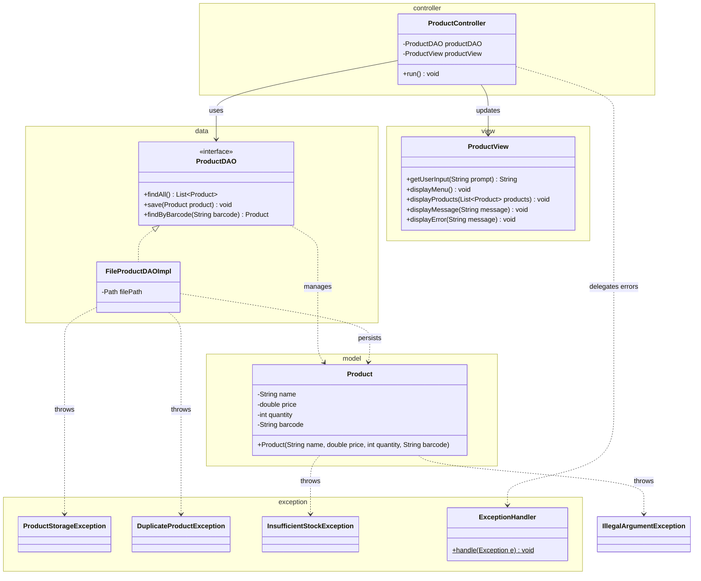

# Workshop: Product Inventory System

## Class Diagram

## Checklist

- [x] Task 1: Create the `Product` class in the `model` package with validation for fields, name, price, quantity, and barcode
- [x] Task 2: Define `ProductStorageException`, `DuplicateProductException`, and `InsufficientStockException` in the `exception` package
- [x] Task 3: Implement `ProductDAO` and `FileProductDAOImpl` in the `data` package
- [x] Task 4: Create the `ProductView` and `ProductController` following the MVC pattern
- [x] Task 5: Explain the MVC design pattern

See [Workshop_3_Product_Inventory.md](Workshop_3_Product_Inventory.md) for full instructions.
