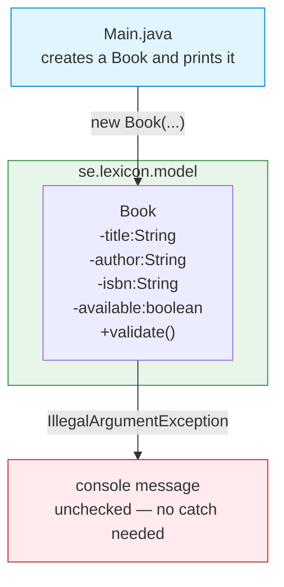
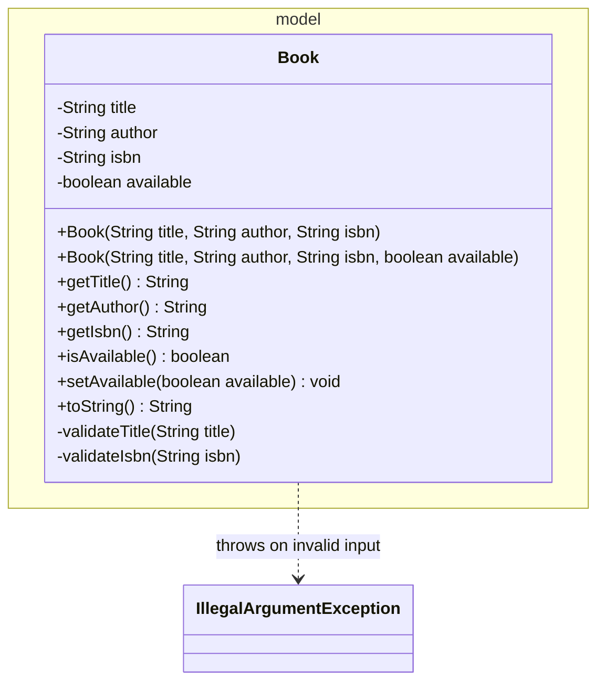
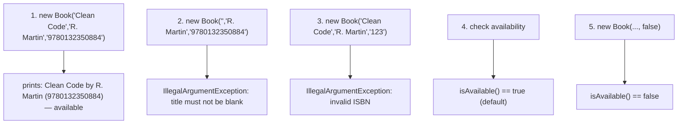

# Workshop: Library Book Management

> **Step 1 of 10** in the progressive series that ends with a full **Event-Manager-style application**
> (model → dao → daoImpl → service → ui → utility → exceptions → sql).

| Difficulty | Hints provided | New Event-Manager part |
|:---:|:---:|:---:|
| 1 / 10 | 12 | `model` — encapsulation & validation |

---

## Objective

Build the **domain model** of a library book management system: a clean, validated `Book`
class that the later steps (DAO, View, Controller, Service, SQL...) will build on.

This step mirrors the `se.lexicon.model` package of the referencing **Event Management App**
(`Event`, `Participant`, `Invitation`, ...): plain Java classes with `private` fields, getters,
a validating constructor/setters, and a well-formed `toString()`.

## Learning Goals

*   Encapsulation — keep fields `private`, expose only getters/setters.
*   Validation with **unchecked exceptions** (`IllegalArgumentException`).
*   **Regular expressions** for format validation (ISBN).
*   Type safety & immutability of simple fields.

---

## Prerequisites & Submission

1.  Maven project, **Group Id:** `se.lexicon`, **Artifact Id:** `library-book-workshop`.
2.  Package structure for this step: `se.lexicon.model`.
3.  Commit after each task. Push this branch when complete.

> Previous steps of this series are the other `workshop-*` branches. Each one adds a little more
> of the Event-Manager architecture and gives **fewer hints**.

---

## Step 1 — Layered target (read this first)

You are building the **first slice** of a layered application. Today it looks like this:

Later steps will add: `view` + `controller` (step 2), `dao` + `daoImpl` (step 3),
`exception` handling (step 4), and so on up to `service`, `utility` and `sql`.

---

## Class Diagram

---

## Test Scenarios (diagram test)

Run each scenario manually after implementing the class, and record the result.

| # | Scenario | Expected result |
|---|----------|-----------------|
| 1 | Valid book (13-digit ISBN) | Object created, `available == true`, readable via getters |
| 2 | Blank `author` or `title` | `IllegalArgumentException` is thrown |
| 3 | ISBN shorter/longer than 13 digits | `IllegalArgumentException` is thrown |
| 4 | `toString()` output | Contains title, author, ISBN and availability |
| 5 | `new Book(t, a, isbn, false)` | Second constructor → `available == false` |

---

## Tasks

### Task 1 — Create the `Book` class

Create `src/main/java/se/lexicon/model/Book.java` with:

*   `private` fields: `String title`, `String author`, `String isbn`, `boolean available`.
*   A constructor `Book(String title, String author, String isbn)` that **defaults** `available = true`.
*   A second constructor `Book(String title, String author, String isbn, boolean available)`.
*   Getters: `getTitle()`, `getAuthor()`, `getIsbn()`, `isAvailable()`.
*   Setter: only `setAvailable(boolean)` (title/author/isbn are read-only after creation).
*   `toString()` returning a readable summary.

### Task 2 — Validate in the constructor

*   `title` and `author` must **not be blank** (empty or whitespace) → else `IllegalArgumentException`.
*   `isbn` must match `^\d{13}$` (exactly 13 digits) → else `IllegalArgumentException`.
*   Perform validation through private helper methods (`validateTitle`, `validateIsbn`).

### Task 3 — Wire it up

*   Make sure `Main.java` creates a few `Book` instances, prints them with `System.out.println`,
    and demonstrates (via try/catch or by letting it crash) that invalid books throw.

### Task 4 — Explain

Write 3–5 sentences in your own words: *why* did we use `IllegalArgumentException`
(unchecked) instead of a checked exception for validation in the model?

---

## Hints & Help (12 hints — this is the friendliest step)

1. A blank-string check: `title == null || title.isBlank()`.
2. The ISBN regex in Java: `isbn.matches("^\\d{13}$")`.
3. Two constructors = **constructor overloading**; both call the same validation.
4. Keep fields guarded — after the constructor, `title`/`author`/`isbn` should not change.
5. Use `this(...)` only if you add a delegating constructor; otherwise keep them independent.
6. `available` default belongs in one place: the 3-arg constructor sets `this.available = true`.
7. `toString()` example shape: `"Clean Code by Robert C. Martin — available"`.
8. Java allows `Author b = new Book(...);` only if `Book` extends/implements `Author` — never do that here.
9. Fields are `private`; the outside world uses getters — this is **encapsulation**.
10. The exception message should say *what* is wrong: `"Title must not be blank"`.
11. Test with `Book("", "x", "9780132350884")` — your code must reject it.
12. Run with `mvn compile` then run `Main`; use the test scenarios above to verify.

---

## Checklist

- [x] `Book` exists in `se.lexicon.model` with `private` fields + getters
- [x] Validation throws `IllegalArgumentException` for blank title/author
- [x] ISBN validated with regex `^\d{13}$`
- [x] `available` defaults to `true`; 4-arg constructor allows setting it
- [x] `toString()` is readable
- [x] All 5 test scenarios pass

## Bonus Challenge (optional)

Add a `boolean isSameBook(Book other)` method that compares by ISBN, and a
`static boolean isValidIsbn(String isbn)` utility method — you will reuse it in later steps.

> Status: **done** on this branch — see `Book.java` (`isSameBook`, `isValidIsbn`).