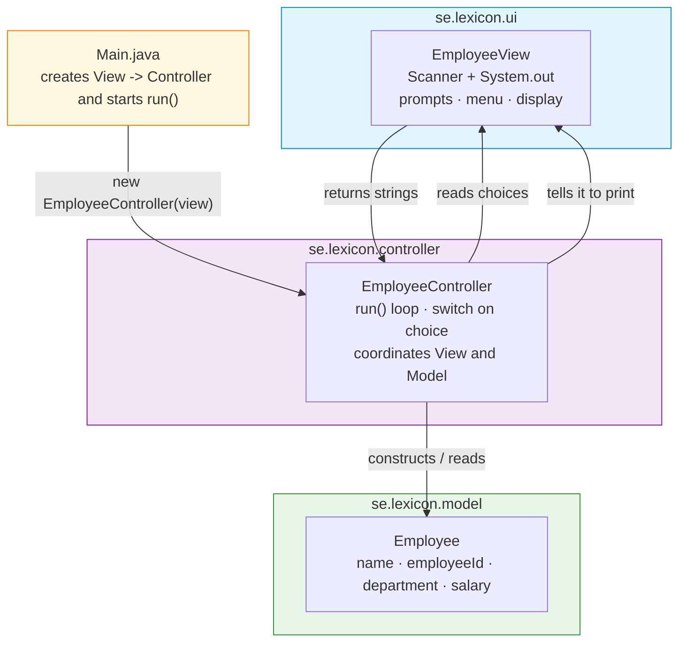
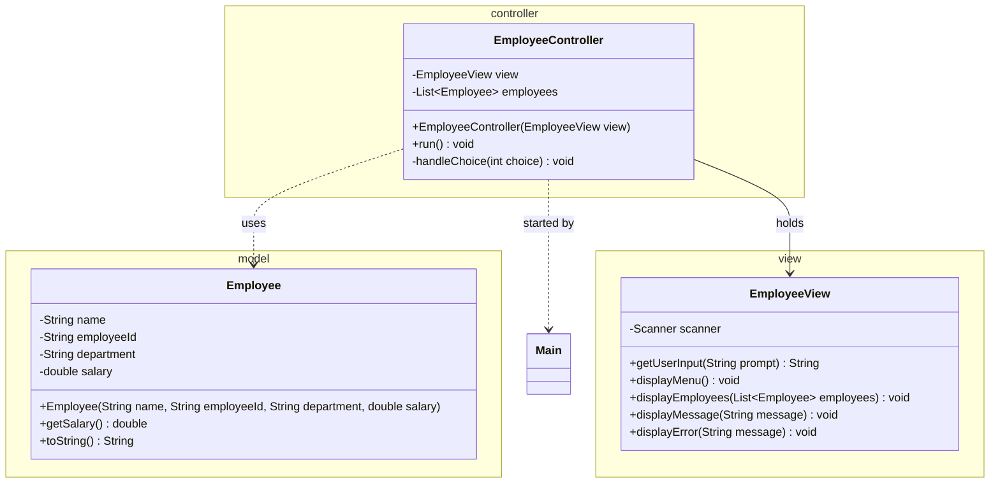
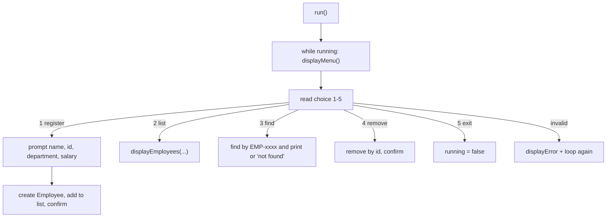

# Workshop: Employee Management System

> **Step 2 of 10** in the progressive series that ends with a full **Event-Manager-style application**
> (model → dao → daoImpl → service → ui → utility → exceptions → sql).

| Difficulty | Hints provided | New Event-Manager part |
|:---:|:---:|:---:|
| 2 / 10 | 11 | `ui` (View) + `controller` — the **MVC** split |

---

## Objective

Split your program into **Model**, **View** and **Controller**. The `Employee` model (from
step-1 style) stays a plain data class; the **View** owns all user interaction
(`Scanner` + `System.out`), and the **Controller** coordinates between user choices and the model.

In the Event Manager app this is the `se.lexicon.ui.AppConsole` layer: *menu loop · input ·
catches exceptions*. You are building the same idea for employees, one step earlier than the
Event Manager does, so you learn the pattern in isolation.

## Learning Goals

*   **Separation of concerns** — the view never holds business logic; the model never prints.
*   A menu loop: `while (running)` + a `switch` on the user's choice.
*   Input reading with `Scanner` and converting strings to numbers safely.
*   Wiring components in `Main` (dependency injection by hand).

---

## Prerequisites

*   Maven project, **Group Id:** `se.lexicon`, **Artifact Id:** `employee-workshop`.
*   Packages: `model`, `view`, `controller` (you may have `Main` at the root).
*   Commit after each task; push this branch when complete.

---

## Step 2 — Layered target

There is no persistence yet — the controller keeps employees in a `List` in memory.

---

## Class Diagram

---

## Test Scenarios (diagram test)

| # | Scenario | Expected result |
|---|----------|-----------------|
| 1 | Menu starts and lists options | Menu printed once, waits for input |
| 2 | Choose `1`, enter `Anna Berg, EMP-0001, IT, 42000` | "Employee added" message |
| 3 | Choose `2` | List shows the added employee via `toString()` |
| 4 | Choose `3`, type `EMP-0001` | Employee found and printed |
| 5 | Choose `3`, type `EMP-9999` | "Employee not found" (no crash) |
| 6 | Choose `abc` | Error message, menu shown again |
| 7 | Choose `5` | Loop exits, program ends |

---

## Tasks

### Task 1 — Model (reuse step 1)

Create `Employee` in `model` with `name`, `employeeId` (pattern `^EMP-\d{4}$`), `department`, `salary`
(positive, else `IllegalArgumentException`) and a readable `toString()`. Private fields, getters only.

### Task 2 — The View

Create `EmployeeView` in `view` with a private `Scanner` and these methods:

*   `String getUserInput(String prompt)` — prints the prompt and returns the next line.
*   `void displayMenu()` — prints the numbered menu.
*   `void displayEmployees(List<Employee>)` — prints each employee line by line.
*   `void displayMessage(String)` / `void displayError(String)`.

The view does **not** decide what happens next — it only reads and prints.

### Task 3 — The Controller

Create `EmployeeController` in `controller`:

*   Field: `EmployeeView view` and `List<Employee> employees` (in memory).
*   Constructor takes the `EmployeeView`.
*   `run()`: `while (running)` → `view.displayMenu()` → read choice → `handleChoice(...)`.
*   `handleChoice(int)`: a `switch` calling private methods: `register()`, `list()`, `find()`, `remove()`.
*   In `register()` use `Double.parseDouble(view.getUserInput("Salary:"))` inside `try`/`catch` so `abc`
    shows an error instead of crashing.

### Task 4 — Wire it in Main

*   `Main`: `EmployeeView view = new EmployeeView();`
*   `EmployeeController controller = new EmployeeController(view);`
*   `controller.run();`

### Task 5 — Explain

Write 4–6 sentences: *why does the controller, not the view, decide the flow?*
(Think: testability, reusing the view for a different controller, keeping UI dumb.)

---

## Hints & Help (11 hints)

1. Start the loop with a `boolean running` and `while (running)`; set it `false` on exit.
2. Read a menu choice as a `String`, then parse it — never read an `int` directly for the menu.
3. Wrap `Integer.parseInt` / `Double.parseDouble` in `try { ... } catch (NumberFormatException e) { view.displayError(...); }` and **loop again**.
4. `findByEmployeeId` is a `for (Employee e : employees)` + `if (e.getEmployeeId().equals(id))`.
5. Remove safely: find the index first, then `employees.remove(index)`.
6. The view needs one shared `Scanner` created once (field), not one per call.
7. `displayEmployees` can simply call `employees.forEach(System.out::println)`.
8. Menu options — keep them a constant `String` block or `String.format` lines; later steps reuse the pattern.
9. Model is step-1 style: `private` fields, getters; salary validated `> 0`.
10. Don't let `register()` print the whole flow — return `boolean` or rely on the controller to call a single `displayMessage`.
11. Keep `Main` tiny (3 lines of wiring). If `Main` grows, the split is wrong.

---

## Checklist

- [ ] `Employee` model with validation in `model`
- [ ] `EmployeeView` owns **all** Scanner/System.out
- [ ] `EmployeeController` with `run()` loop + `switch`
- [ ] `Main` only wires components and calls `run()`
- [ ] Invalid choice / invalid number → error message, loop continues
- [ ] All 7 test scenarios pass

## Bonus Challenge (optional)

Add menu option **6 — statistics**: print average salary (compute in the controller, display via view).
Then explain why the controller holds the calculation and the view only prints.