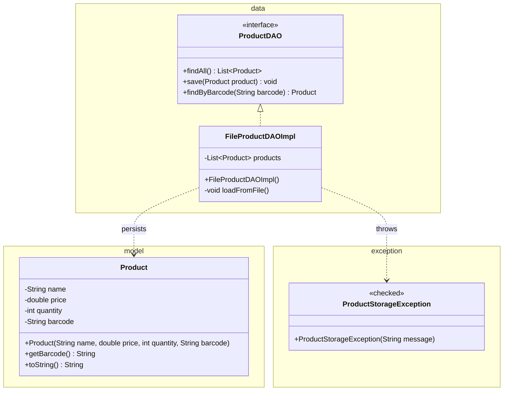
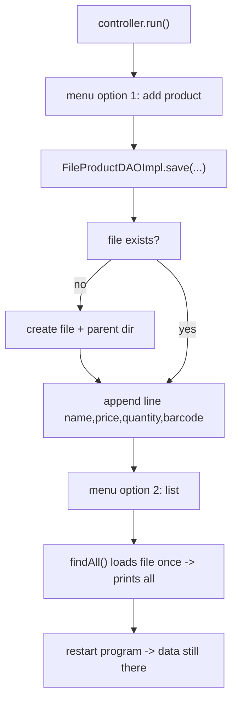

# Workshop: Product Inventory System

> **Step 3 of 10** in the progressive series that ends with a full **Event-Manager-style application**
> (model → dao → daoImpl → service → ui → utility → exceptions → sql).

| Difficulty | Hints provided | New Event-Manager part |
|:---:|:---:|:---:|
| 3 / 10 | 10 | `dao` (interface) + `daoImpl` (file persistence) |

---

## Objective

Introduce the **data access layer**: an interface (`ProductDAO`) that hides *where* data lives and
an implementation (`FileProductDAOImpl`) that stores products **in a text file**. In the Event Manager
app this layer becomes the `se.lexicon.dao` package (`EventDAO` / `EventDAOImpl`, JDBC + SQL). Here we
learn the *interface/implementation* pattern with **file I/O**, **try-with-resources** and checked
`IOException` handling first.

The golden rule of this step: **a DAO never prints to the console** — it communicates only through
return values and exceptions.

## Learning Goals

*   Program against an **interface** (`ProductDAO`), not the implementation.
*   File I/O: write every field on one line, separated by commas.
*   **Try-with-resources** for `BufferedWriter` / `Files.lines(...)`.
*   Wrap checked `IOException` into your own checked `ProductStorageException`.
*   Lazy-loading the file into memory on the first access (`findAll()`).

---

## Prerequisites

*   Maven project, **Group Id:** `se.lexicon`, **Artifact Id:** `product-inventory-workshop`.
*   Packages: `model`, `data`, `view`, `controller`, `exception`.
*   You can reuse the `ProductView`/`ProductController` pattern from step 2.
*   Commit after each task; push this branch when complete.

---

## Step 3 — Layered target

```mermaid
flowchart TD
    subgraph DAO["se.lexicon.data"]
        IFACE["ProductDAO <<interface>>\nfindAll() · save() · findByBarcode()"]
        IMPL["FileProductDAOImpl\nloads products.txt into List\nappends on save()"]
    end

    CTRL["ProductController\n(step 2 pattern)"]
    FILE[("products.txt\nname,price,quantity,barcode\n...")]

    CTRL -->|"calls interface methods"| IFACE
    IFACE <|.. IMPL : implements
    IMPL -->|"read / write lines"| FILE
    IMPL ..>|"throws ProductStorageException"| CTRL

    style DAO fill:#e8f5e9,stroke:#388e3c
    style CTRL fill:#f3e5f5,stroke:#7b1fa2
    style FILE fill:#fff3e0,stroke:#f57c00
```

The controller must know **only** the interface — swap the file implementation for a JDBC one in
later steps without touching the controller.

---

## Class Diagram



---

## Test Scenarios (diagram test)



| # | Scenario | Expected result |
|---|----------|-----------------|
| 1 | Add `Coffee, 49.5, 20, 12345678` | Line appended to `products.txt` |
| 2 | List products | All products (including previously added) printed from file |
| 3 | Add product with **existing barcode** | Duplicate rejected (see Task 2) — message shown |
| 4 | Find by `12345678` | Product found and printed |
| 5 | Find by `00000000` | `null` → "Product not found" |
| 6 | **Restart the app** and list | Data persists — came from the file, not memory |
| 7 | Delete `products.txt` and list | App creates the file/dir again (no crash) |

---

## Tasks

### Task 1 — Model

`Product` in `model`: `name` (not blank), `price` (> 0), `quantity` (>= 0), `barcode` (`^\d{8}$`).
Getters; `toString()`. Invalid input → `IllegalArgumentException`.

### Task 2 — Data exceptions

Create checked exceptions in `exception`:

*   `ProductStorageException extends Exception` — for file problems.
*   `DuplicateProductException extends Exception` — thrown by `save` when barcode (or name) already exists.

> Hint: these are **checked**, so methods that throw them must declare `throws`.

### Task 3 — The DAO interface

```java
public interface ProductDAO {
    List<Product> findAll() throws ProductStorageException;
    void save(Product product) throws ProductStorageException, DuplicateProductException;
    Product findByBarcode(String barcode) throws ProductStorageException;
}
```

### Task 4 — The file implementation `FileProductDAOImpl`

*   Field `List<Product> products`, lazily filled from `products.txt` on first `findAll()`.
*   **Read:** `Files.lines(Paths.get("dir/products.txt"))` inside try-with-resources; split each line with `,`.
*   **Write:** `Files.newBufferedWriter(path, StandardOpenOption.CREATE, StandardOpenOption.APPEND)`.
*   `save()`: check for duplicate barcode/name in the loaded list FIRST, then append.
*   Every `IOException` → `ProductStorageException("Failed to ... ", e)`.

### Task 5 — Wire into the controller

*   Change the controller to hold `ProductDAO productDAO` instead of a `List`.
*   `Main`: build `FileProductDAOImpl` once, pass it as `ProductDAO` to the controller.
*   Controller catches `ProductStorageException` / `DuplicateProductException` and calls `view.displayError(...)`.

### Task 6 — Explain

Write 3–5 sentences: *why does the controller depend on the interface, not on `FileProductDAOImpl`?*

---

## Hints & Help (10 hints)

1. File format → one line per product: `name,price,quantity,barcode`.
2. Load once: `if (products.isEmpty()) { loadFromFile(); }` at the top of `findAll()`.
3. For each line: `String[] parts = line.split(","); double price = Double.parseDouble(parts[1]);` then `new Product(...)`.
4. Sleep-worthy detail: make sure the parent directory exists with `Files.createDirectories(parent)` before writing.
5. `Path path = Paths.get("dir/products.txt");` — use one constant so read and write agree.
6. Only `findAll()` needs to read the file; `save()` only appends.
7. Catching `IOException e` and throwing `new ProductStorageException("message", e)` keeps the original error in the cause.
8. Duplicate check goes in the DAO, **not** the controller — persistence owns uniqueness.
9. `Files.lines(...)` is an AutoCloseable `Stream` — try-with-resources closes it for you.
10. Parse defensively: wrap `split`/`parse` in the same `findAll` try-block so a corrupt line becomes `ProductStorageException`, not a crash.

---

## Checklist

- [ ] `Product` model validated (`IllegalArgumentException`)
- [ ] `ProductStorageException`, `DuplicateProductException` (checked)
- [ ] `ProductDAO` interface + `FileProductDAOImpl` (file, try-with-resources)
- [ ] DAO never prints; errors flow out as exceptions
- [ ] Controller depends on `ProductDAO` interface only
- [ ] Data survives app restart (test scenario 6 & 7)

## Bonus Challenge (optional)

Add **purchase**: `void purchase(String barcode, int amount)` on the DAO that reduces quantity and
rewrites the affected line; throw `InsufficientStockException` (checked) if `amount > quantity`.
Persist the change to the file so it survives restart.