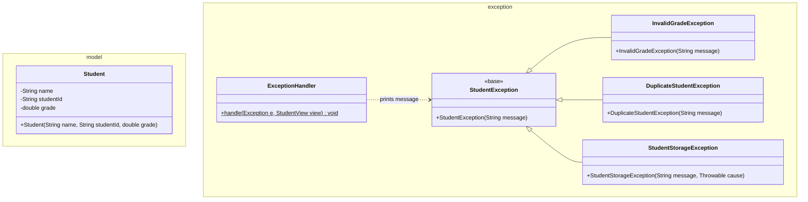
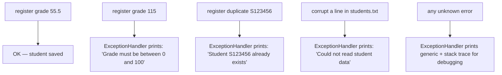

# Workshop: Student Grade Tracker

> **Step 4 of 10** in the progressive series that ends with a full **Event-Manager-style application**
> (model → dao → daoImpl → service → ui → utility → exceptions → sql).

| Difficulty | Hints provided | New Event-Manager part |
|:---:|:---:|:---:|
| 4 / 10 | 9 | `exception` — custom exceptions + centralized `ExceptionHandler` |

---

## Objective

This is the **exceptions** step — the heart of this whole workshop series. You will define a family of
**custom exceptions** and stop scattering try/catch all over the code by adding one **centralized
`ExceptionHandler`**. In the Event Manager app this maps to `se.lexicon.exception` — a base
`EventException` with typed subclasses (`InvalidGradeException`, `DuplicateStudentException`,
`StudentStorageException`…), where the UI layer catches everything in one place.

## Learning Goals

*   Checked (`extends Exception`) vs unchecked (`extends RuntimeException`) exceptions and when each fits.
*   A custom exception **hierarchy**: a common base type + specific subclasses.
*   Error messages that carry useful context (the offending id/value).
*   A single `ExceptionHandler.handle(...)` used by the controller — **no duplicate catch blocks**.
*   Decide *where* each exception is thrown / wrapped / caught (the "35 000 m" view of the app).

---

## Prerequisites

*   Maven project, **Group Id:** `se.lexicon`, **Artifact Id:** `student-grade-workshop`.
*   You have `model`, `view`, `controller`, `data` packages from steps 1–3.
*   Commit after each task; push this branch when complete.

---

## Step 4 — Exception flow

```mermaid
flowchart TD
    subgraph MODEL["model"]
        ST["Student\nthrow InvalidGradeException if grade not in 0..100"]
    end

    subgraph DATA["data"]
        IMPL["FileStudentDAOImpl\nwrap IOException in StudentStorageException"]
    end

    subgraph CTRL["controller"]
        CTRL["StudentController.handleChoice(...)\ntry { ... } catch (Exception e) { ExceptionHandler.handle(e, view); }"]
    end

    subgraph EXC["exception (single place to fix messages/format)"]
        EH["ExceptionHandler\n+ handle(Exception, StudentView)\nprints user-friendly line"]
    end

    ST -->|"throws"| CTRL
    IMPL -->|"throws"| CTRL
    CTRL -->|"every catch calls"| EH
    EH -->|"displayError(...)"| CTRL

    style MODEL fill:#e8f5e9,stroke:#388e3c
    style DATA fill:#e8f5e9,stroke:#388e3c
    style CTRL fill:#f3e5f5,stroke:#7b1fa2
    style EXC fill:#ffebee,stroke:#c62828
```

Rule of thumb for **where**:
*   **Model**: throw specific, descriptive exceptions (validation).
*   **DAO**: catch low-level (`IOException`) and *wrap* in your own exception.
*   **Controller/UI**: catch the app exceptions once, centrally, and print friendly messages.

---

## Class Diagram



> Suggested: make `StudentException` **checked** (extends `Exception`) so the compiler forces you to
> handle every app error path. (In the Event Manager it is unchecked — decide yourself and justify it.)

---

## Test Scenarios (diagram test)



| # | Scenario | Expected result |
|---|----------|-----------------|
| 1 | Register valid student with grade `55.5` | Saved; `findAll` shows it |
| 2 | Register with grade `115` | `InvalidGradeException` → friendly message, **loop continues** |
| 3 | Register the same `studentId` twice | `DuplicateStudentException` → friendly message |
| 4 | Enter letters where grade expected | Number-format error → friendly message (no crash) |
| 5 | Corrupt `students.txt` (e.g. add `x,y,z`) | `StudentStorageException` → friendly message |
| 6 | Trigger any unexpected exception | Handler shows generic message; app still returns to menu |

---

## Tasks

### Task 1 — Model

`Student` (`name` not blank, `studentId` matches `^S\d{6}$`). For the grade, do **not** throw
`IllegalArgumentException` — throw a custom `InvalidGradeException` (grade must be `0.0 .. 100.0`).

### Task 2 — The exception family

In `exception` create:

*   `StudentException` (base, checked) — message constructor.
*   `InvalidGradeException extends StudentException`.
*   `DuplicateStudentException extends StudentException`.
*   `StudentStorageException extends StudentException` — add a `(String, Throwable)` constructor.

### Task 3 — DAO uses them

Reuse the step-3 pattern for `StudentDAO` / `FileStudentDAOImpl` (file `name,studentId,grade`).
Wrap every `IOException` as `StudentStorageException`; throw `DuplicateStudentException` on duplicate id.
**(v3.1)** In `save(...)`, *throw* `DuplicateStudentException` only if a student with that id already exists.

### Task 4 — The centralized handler

```java
public final class ExceptionHandler {
    public static void handle(Exception e, StudentView view) {
        if (e instanceof StudentException) {
            view.displayError(e.getMessage());
        } else if (e instanceof NumberFormatException) {
            view.displayError("Please enter a valid number.");
        } else {
            view.displayError("Unexpected error: " + e.getMessage());
            e.printStackTrace(); // keep for debugging
        }
    }
}
```

### Task 5 — Rewire the controller

In `handleChoice(...)` wrap each menu action in **one** `try/catch(Exception e)`
that calls `ExceptionHandler.handle(e, view)`. Delete every other catch block you wrote in step 2/3.

### Task 6 — Explain

Write 4–6 sentences: *checked vs unchecked — why is a "storage" failure a checked exception, and why is a
"bad grade" best as either? Which choice did you make for `StudentException` and why?*

---

## Hints & Help (9 hints)

1. Checked = the compiler forces callers to handle it → good for *recoverable, expected* failures (file problems, duplicates).
2. Unchecked = no compile-time obligation → good for *programmer errors* and *validation of one object* (bad argument).
3. Use `super(message)` in every custom exception constructor — the message must survive up the hierarchy.
4. A `(String, Throwable)` constructor chains the cause: `super(message, cause);` keeps the original stack trace.
5. Catch order matters: catch `StudentException` before `Exception` in `handle(...)` (more specific first).
6. `instanceof` in the handler is the simple version — an *enum or method override* per exception is the advanced one.
7. To make a file "corrupt" for testing, add a line that doesn't split into exactly 3 parts and watch `findAll()` fail gracefully.
8. The controller should have **one** `try` per menu action, not try/catch nests — the handler is the single exit.
9. Don't `printStackTrace()` for *expected* business errors; reserve it for `else` (unknown) branch.

---

## Checklist

- [ ] `Student` throws `InvalidGradeException` (not `IllegalArgumentException`)
- [ ] Exception family: base + 3 subclasses with proper constructors
- [ ] DAO wraps `IOException` and throws duplicates as app exceptions
- [ ] `ExceptionHandler` is the **only** place that decides error text
- [ ] Controller has one catch per action → handler
- [ ] All 6 test scenarios pass

## Bonus Challenge (optional)

Make `ExceptionHandler` return a message *object* instead of printing, and move printing to the view:
`ExceptionHandler.handle(e)` → returns `AppMessage` → `view.show(message)`. Compare that to the direct-print version: which is easier to unit-test?