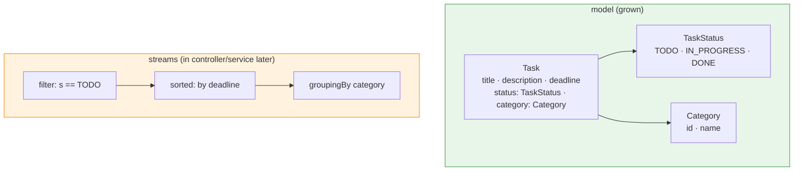
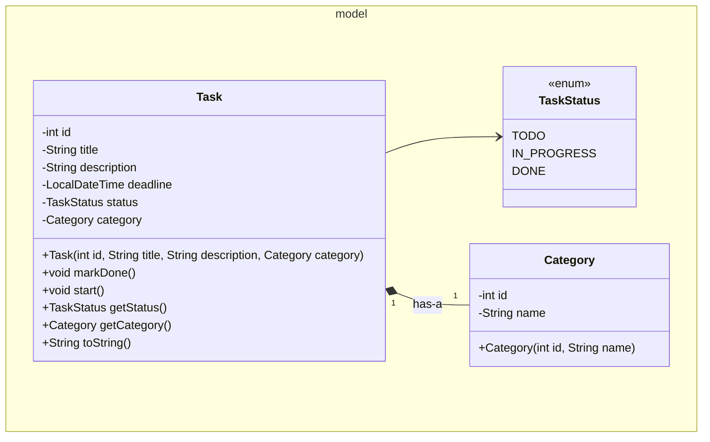

# Workshop: Task/Todo Manager

> **Step 5 of 10** in the progressive series that ends with a full **Event-Manager-style application**
> (model → dao → daoImpl → service → ui → utility → exceptions → sql).

| Difficulty | Hints provided | New Event-Manager part |
|:---:|:---:|:---:|
| 5 / 10 | 8 | `model` made richer — **enums**, a second entity, and **streams** over collections |

---

## Objective

Your model grows up. Add a **`TaskStatus` enum** (type safety over raw booleans/strings — the Event
Manager uses `InvitationStatus`, and later steps use SQL `ENUM`s) and a **second entity** `Category`
so a task belongs to a category. Then use **Streams** (`filter`, `sorted`, `groupingBy`) to answer
real questions like *"all overdue TO-DO tasks, sorted by deadline"*.

This step maps to the Event Manager's richer `model` (`InvitationStatus` enum, `Event` + `Participant`
+ `Invitation`) and to its "Collections & streams" checklist.

## Learning Goals

*   **Enums**: `TaskStatus { TODO, IN_PROGRESS, DONE }` — with a `displayName` if handy.
*   **Composition**: `Task has-a Category` (like `Invitation has-a Event`).
*   **Stream pipelines**: filter → sort → collect; `Collectors.groupingBy`.
*   Keep encapsulation: the enum *lives in the model*, status changes via a method (`markDone()`).

---

## Prerequisites

*   Maven project, **Group Id:** `se.lexicon`, **Artifact Id:** `task-manager-workshop`.
*   Layers up to step 4 are expected (model + view + controller + exception handler).
*   Commit after each task; push this branch when complete.

---

## Step 5 — Layered target



`Task` **composes** a `Category` (has-a). Neither Task nor Category knows about the console —
messages still flow through the exception-handling pattern from step 4.

---

## Class Diagram



---

## Test Scenarios (diagram test)

| # | Scenario | Expected result |
|---|----------|-----------------|
| 1 | Add task "T1" in category "School", deadline tomorrow | Task added with `TODO` status |
| 2 | Add another task with a **past** deadline | Task still stored (overdue is a query concern, not storage) |
| 3 | Mark task "T1" done | `getStatus() == DONE` |
| 4 | List **all TODO tasks sorted by deadline** | Only TODO tasks, earliest deadline first |
| 5 | Group all tasks by category | Map with one key per category, correct counts |
| 6 | Delete by task id | Task gone; deleting unknown id shows error (via handler) |
| 7 | Create a task with a **blank** title | Error via the step-4 handler, loop continues |

---

## Tasks

### Task 1 — The enum

```java
public enum TaskStatus { TODO, IN_PROGRESS, DONE }
```

Add a `displayName` field if you want nicer output (`In progress` instead of `IN_PROGRESS`).

### Task 2 — Two entities

*   `Category`: `int id`, `String name` (not blank), getters, `toString`.
*   `Task`: `int id`, `title` (not blank), `description`, `LocalDateTime deadline`,
    `TaskStatus status` (default `TODO`), `Category category`.
*   Behavior **methods** instead of bare setters: `start()` → `IN_PROGRESS`, `markDone()` → `DONE`.
*   Validate: blank title/description → `IllegalArgumentException`; `deadline == null` → `IllegalArgumentException`.

### Task 3 — Persistence (file)

`TaskDAO` / `FileTaskDAOImpl` (pattern from step 3). Line format:
`id,title,description,deadline,status,categoryId,categoryName`
Recreate enum + `Category` when reading (`TaskStatus.valueOf(...)`, `Category` constructor).

### Task 4 — Queries with streams (in the controller for now)

Implement these menu options using **streams** (one pipeline each):

*   `listByStatus(TaskStatus)`: `tasks.stream().filter(t -> t.getStatus() == status).toList()`
*   `listByDeadline()`: sort with `Comparator.comparing(Task::getDeadline)`.
*   `groupByCategory()`: `Collectors.groupingBy(Task::getCategory, Collectors.counting())`.

### Task 5 — Explain

Write 4–6 sentences comparing: `boolean completed` vs `TaskStatus status` — what can a status enum
express that a boolean cannot? Where would you *not* use an enum?

---

## Hints & Help (8 hints)

1. `valueOf` throws `IllegalArgumentException` for unknown names — read the file `status` with safe `.toUpperCase()`.
2. Use `GroupingBy` with a second collector (`counting()`) to get counts per category.
3. `Comparator.comparing(Task::getDeadline)` replaces a hand-written lambda and reads aloud.
4. Store the enum *name* in the file; restore with `TaskStatus.valueOf(name)`.
5. Keep `Category` immutable — id + name are fixed after construction (like `Event.maxCapacity`).
6. Write the deadline using `DateTimeFormatter.ISO_LOCAL_DATE_TIME` and parse it back with the same formatter.
7. Menu: keep "list all", "list TODO", "list DONE", "group by category" as separate small switch options — each is one stream line.
8. When a task is not found for delete, throw your step-4 exception and let the handler print it — don't `System.out` inside the controller action.

---

## Checklist

- [ ] `TaskStatus` enum (TODO, IN_PROGRESS, DONE)
- [ ] `Category` + `Task` with composition (`Task has-a Category`)
- [ ] Status changes via `start()` / `markDone()` only
- [ ] File persistence round-trips enum + category (test scenario 4 after restart)
- [ ] Stream queries: filter, sort, group — one pipeline each
- [ ] Blank title/deadline → handled error, loop continues

## Bonus Challenge (optional)

Add `overdue()` — tasks where `deadline.isBefore(LocalDateTime.now()) && status != DONE`,
sorted by deadline. Then add a tiny statistic with `Collectors.summarizingLong(...)`.
These are the exact patterns the Event Manager uses for "upcoming events" and "available spots".