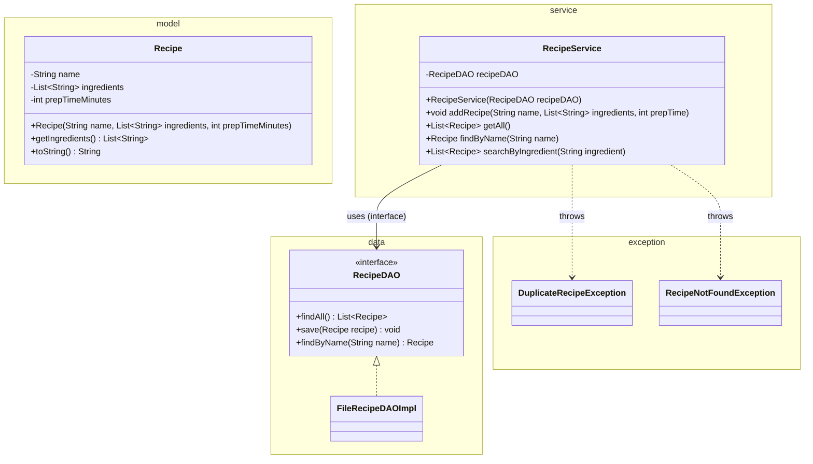
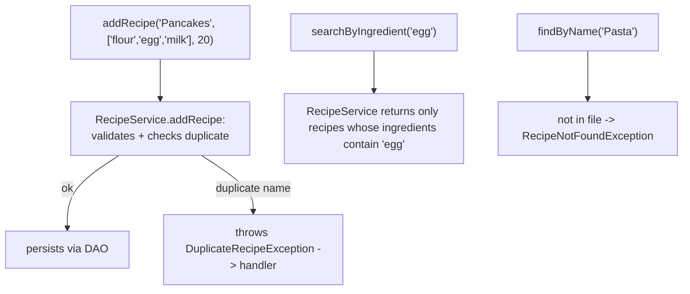

# Workshop: Recipe Manager

> **Step 6 of 10** in the progressive series that ends with a full **Event-Manager-style application**
> (model → dao → daoImpl → service → ui → utility → exceptions → sql).

| Difficulty | Hints provided | New Event-Manager part |
|:---:|:---:|:---:|
| 6 / 10 | 7 | `service` — the business-logic layer (`ServiceManager` pattern) |

---

## Objective

Introduce the layer that makes the Event Manager an *application* rather than a CRUD demo: the
**service layer**. Until now your controller talked **directly to the DAO** — that mixes *user flow*
(the controller) with *business rules* (validation like "ingredient exists", "no duplicate name",
"cannot edit a published recipe"). You will create a **`RecipeService`** that owns every business
rule, and slim the controller down to read input, call the service, and display the result.

This maps one-to-one to `se.lexicon.service.ServiceManager` in the Event Manager app.

## Learning Goals

*   A **service** receives a DAO (interface) via its constructor and hides it from the UI.
*   Business rules & their exceptions live **in the service**, not the controller.
*   The controller becomes a thin *orchestrator* between view and service.
*   Single responsibility: UI = I/O, Service = rules, DAO = persistence.

---

## Prerequisites

*   Maven project, **Group Id:** `se.lexicon`, **Artifact Id:** `recipe-manager-workshop`.
*   All patterns from steps 1–5 are assumed (`model`, `view`, `controller`, `data`, `exception`).
*   Commit after each task; push this branch when complete.

---

## Step 6 — Layered target

```mermaid
flowchart TD
    subgraph UI["ui / controller"]
        VIEW["RecipeView"]
        CTRL["RecipeController\nreads input, calls service,\ndisplays via view"]
    end

    subgraph SERVICE["service (NEW)"]
        SVC["RecipeService\naddRecipe() · findByName() · searchByIngredient()\nVALIDATION: blank name, prep-time > 0,\nduplicate name -> throws exceptions"]
    end

    subgraph DATA["data"]
        DAO["RecipeDAO <<interface>>"]
        IMPL["FileRecipeDAOImpl"]
    end

    MODEL["Recipe (model)"]

    CTRL -->|"calls, no rule logic"| SVC
    SVC -->|"calls persistence"| DAO
    DAO <|.. IMPL
    IMPL ..> MODEL : maps
    SVC ..> MODEL : reads/writes

    style UI fill:#e1f5fe,stroke:#0288d1
    style SERVICE fill:#f3e5f5,stroke:#7b1fa2
    style DATA fill:#e8f5e9,stroke:#388e3c
```

`RecipeService` is the **only** place that knows business rules. The controller literally cannot
enforce them — it has no reference to the DAO anymore.

---

## Class Diagram



---

## Test Scenarios (diagram test)



| # | Scenario | Expected result |
|---|----------|-----------------|
| 1 | Add `Pancakes` once | Saved and shown in `getAll()` |
| 2 | Add `Pancakes` again | `DuplicateRecipeException` → friendly message |
| 3 | Add recipe with `prepTime <= 0` | `IllegalArgumentException` from validation → friendly message |
| 4 | Search ingredient `egg` | Only recipes containing `egg` (case-insensitive) |
| 5 | Find `Pasta` (not stored) | `RecipeNotFoundException` → friendly message |
| 6 | Inspect the controller | It never calls the DAO — only the service (verify by reading the import list) |

---

## Tasks

### Task 1 — Model with a `List`

`Recipe`: `String name` (not blank), `List<String> ingredients` (not empty, no blank entries),
`int prepTimeMinutes` (> 0), getters, `toString()` (list the first 3 ingredients + "... and N more").

### Task 2 — DAO (reuse the pattern)

`RecipeDAO` interface + `FileRecipeDAOImpl`.
File format: `name|ingredient1;ingredient2;ingredient3|prepTimeMinutes`
(`|` separates fields, `;` separates ingredients — commas inside ingredients are now safe).

### Task 3 — The service

Create `RecipeService` in `service`:

*   Constructor takes `RecipeDAO` (store it; the controller never sees it).
*   `void addRecipe(String name, List<String> ingredients, int prepTime)` —
    small **validations first**, then `dao.findByName(name)` to reject duplicates
    (`DuplicateRecipeException`), then `dao.save(...)`.
*   `List<Recipe> getAll()` — delegates to `dao.findAll()`.
*   `Recipe findByName(String name)` — `dao.findByName`; `null` → `RecipeNotFoundException`.
*   `List<Recipe> searchByIngredient(String ingredient)` — stream over `getAll()`, case-insensitive `contains`.

### Task 4 — Slim the controller

Move **all** business logic out of `RecipeController`:

*   Controller field becomes `RecipeService recipeService` (plus the view).
*   Each menu option: read input → **one** call to the service → display.
*   Keep the single try/catch → `ExceptionHandler` from step 4.

### Task 5 — Wire in Main

`FileRecipeDAOImpl dao = new FileRecipeDAOImpl();`
`RecipeService service = new RecipeService(dao);`
`new RecipeController(service, view).run();`

### Task 6 — Explain

Write 4–6 sentences: *if you replaced the file DAO with a JDBC DAO tomorrow, which files change?*
(Answer: only `Main`, and the new impl — the service and controller stay identical. That is the whole
point of the multi-layer design.)

---

## Hints & Help (7 hints)

1. The service constructor accepts the **interface**, so it accepts *any* future implementation.
2. Validate before you persist: rules (`duplicate`, `blank`) run before `dao.save`.
3. `searchByIngredient`: `recipes.stream().filter(r -> r.getIngredients().stream().anyMatch(i -> i.toLowerCase().contains(needle.toLowerCase()))).toList()`.
4. Duplicate check belongs in the service (rule), **not** in the DAO (persistence) — compare this design to step 3, where the DAO checked duplicates. Discuss which you prefer.
5. `RecipeNotFoundException`: keep step-4's exception hierarchy — this is just another subtype.
6. The controller imports `se.lexicon.service.RecipeService` and *never* `se.lexicon.data.FileRecipeDAOImpl`.
7. Use `String.join(";", ingredients)` to write and `List.of(line.split(";"))` to read.

---

## Checklist

- [ ] `Recipe` with `List<String> ingredients` + validation
- [ ] DAO file format handles ingredient lists (`|` and `;`)
- [ ] `RecipeService` holds all business rules + duplicate/not-found exceptions
- [ ] Controller calls **only** the service (no DAO import)
- [ ] `Main` wires dao → service → controller
- [ ] All 6 test scenarios pass

## Bonus Challenge (optional)

Add `void updateName(String oldName, String newName)` in the service that rejects duplicates and
re-persists the changed recipe. Then add recipes with a `Difficulty` enum (step-5 pattern) so
`searchByIngredient` can also filter by difficulty — an easy warm-up for step 10's full model.