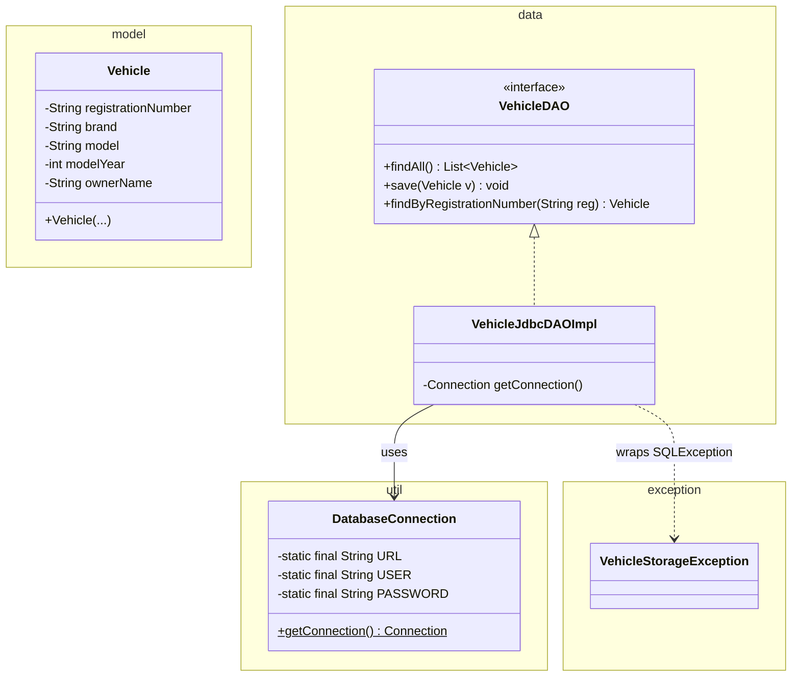

# Workshop: Vehicle Registration — your first JDBC DAO

> **Step 7 of 10** in the progressive series that ends with a full **Event-Manager-style application**
> (model → dao → daoImpl → service → ui → **util** → **SQL** → **JDBC** → exceptions).

| Difficulty | Hints provided | New Event-Manager parts |
|:---:|:---:|:---:|
| 7 / 10 | 6 | `util` + SQL schema + your **first JDBC DAO** — the moment the app talks to MySQL |

---

## Objective

Until now every model was persisted to a **text file**. Real applications persist to a **database**.
In this step you leave the file-based DAO behind and implement the mechanics the Event Manager's
`se.lexicon.util.DatabaseConnection` provides:

1.  A **`DatabaseConnection`** utility that opens and hands out JDBC `Connection`s.
2.  A **SQL schema** (`SQL_database/vehicle_registration.sql`) that builds the `vehicle` table.
3.  A **`VehicleJdbcDAOImpl`** whose `findAll/save/findByRegistrationNumber` actually run SQL.

Your service, controller and view from steps 2–6 stay **unchanged** — that is the payoff of the
layered design you have been building.

## Learning Goals

*   The JDBC dance: `DriverManager.getConnection` → `PreparedStatement` → `executeQuery/executeUpdate`;
    `ResultSet → object` mapping; `try-with-resources` for everything.
*   `PreparedStatement` with `?` placeholders (prevents SQL injection — never concatenate strings into SQL).
*   A single, reusable `DatabaseConnection` (singleton) instead of scattered `getConnection` calls.
*   Reading a real schema file and creating the table in MySQL/Workbench.

---

## Prerequisites

*   MySQL Server running locally (XAMPP or native install) — or a Docker MySQL container.
*   A database named `vehicle_db` and a user with rights to it.
*   Layers from steps 1–6 are assumed.
*   Commit after each task; push this branch when complete.

---

## Step 7 — Layered target

```mermaid
flowchart TD
    subgraph UI["ui + controller (unchanged from steps 2 & 6)"]
        VIEW["VehicleView"]
        CTRL["VehicleController"]
        SVC["VehicleService"]
    end

    subgraph DATA["data — NOW JDBC"]
        DAO["VehicleDAO <<interface>>"]
        JDBC["VehicleJdbcDAOImpl\nPreparedStatement + ResultSet"]
    end

    subgraph UTIL["util (NEW)"]
        DB["DatabaseConnection\nstatic getConnection() Connection"]
    end

    subgraph SQL["SQL_database/ (NEW)"]
        SCHEMA["vehicle_registration.sql\nCREATE TABLE vehicle ..."]
    end

    MYSQL[("MySQL\nvehicle_db.vehicle")]

    CTRL --> SVC --> DAO
    DAO <|.. JDBC
    JDBC -->|"jdbc:mysql://..."| DB
    DB --> MYSQL
    SCHEMA -.->|"run once in Workbench"| MYSQL

    style UI fill:#e1f5fe,stroke:#0288d1
    style DATA fill:#e8f5e9,stroke:#388e3c
    style UTIL fill:#fff3e0,stroke:#f57c00
    style SQL fill:#fce4ec,stroke:#c62828
```

Compare with the Event Manager: the same `DatabaseConnection` + `SQL_database/event_management.sql`
are what every later DAO (Participant, Event, Invitation) builds on.

---

## Class Diagram



---

## Test Scenarios (diagram test)

| # | Scenario | Expected result |
|---|----------|-----------------|
| 1 | `schema.sql` run in Workbench | `vehicle` table exists (check the schema pane) |
| 2 | Add vehicle `ABC123`, Toyota, Corolla, 2020, Anna | Row appears in the table; `getAll()` shows it |
| 3 | Add `ABC123` again | `DuplicateVehicleException` (service rule) — no duplicate row in DB |
| 4 | Insert a row *manually in Workbench*, then run the app | `getAll()` shows it too — the app reads real data |
| 5 | Stop MySQL, then call `findAll` | `VehicleStorageException` → friendly handler message (not a stack trace) |
| 6 | Edit a registration number to `ABC12–3` in the running app | `IllegalArgumentException` (validation), loop continues |

---

## Tasks

### Task 1 — JDBC dependency + the connection utility

Add to `pom.xml`:

```xml
<dependency>
    <groupId>com.mysql</groupId>
    <artifactId>mysql-connector-j</artifactId>
    <version>8.4.0</version>
</dependency>
```

Create `util.DatabaseConnection` (mirror `se.lexicon.util.DatabaseConnection`):

```java
public final class DatabaseConnection {
    private static final String URL = "jdbc:mysql://localhost:3306/vehicle_db";
    private static final String USER = "root";
    private static final String PASSWORD = "your_password_here";

    private DatabaseConnection() { }

    public static Connection getConnection() throws SQLException {
        return DriverManager.getConnection(URL, USER, PASSWORD);
    }
}
```

Keep the credentials here for now (it's a local classroom DB). Real apps read them from an
environment variable or `db.properties` — never commit real passwords.

### Task 2 — The schema

Create `SQL_database/vehicle_registration.sql`:

```sql
CREATE DATABASE IF NOT EXISTS vehicle_db;
USE vehicle_db;

CREATE TABLE IF NOT EXISTS vehicle (
    id INT AUTO_INCREMENT PRIMARY KEY,
    registration_number VARCHAR(10) NOT NULL UNIQUE,
    brand VARCHAR(50) NOT NULL,
    model VARCHAR(50) NOT NULL,
    model_year INT NOT NULL,
    owner_name VARCHAR(100) NOT NULL
);
```

Run it once in MySQL Workbench. The `UNIQUE` on `registration_number` is the database-level guard
that matches the service-level duplicate check.

### Task 3 — The model

`Vehicle`: `registrationNumber` (must match `^[A-Z]{3}\d{3}$`),
`brand`/`model` (not blank), `modelYear` (>= 1886), `ownerName` (not blank).
Validation in the constructor/setters → `IllegalArgumentException`.

### Task 4 — `VehicleDAO` + `VehicleJdbcDAOImpl`

Interface first, then the JDBC implementation. The two hard-won JDBC patterns:

```java
// read
String sql = "SELECT * FROM vehicle";
try (Connection c = DatabaseConnection.getConnection();
     Statement st = c.createStatement();
     ResultSet rs = st.executeQuery(sql)) {
    while (rs.next()) {
        vehicles.add(new Vehicle(
            rs.getString("registration_number"),
            rs.getString("brand"),
            rs.getString("model"),
            rs.getInt("model_year"),
            rs.getString("owner_name")));
    }
} catch (SQLException e) {
    throw new VehicleStorageException("Could not read vehicles", e);
}

// write
String sql = "INSERT INTO vehicle (registration_number, brand, model, model_year, owner_name) VALUES (?, ?, ?, ?, ?)";
try (Connection c = DatabaseConnection.getConnection();
     PreparedStatement ps = c.prepareStatement(sql)) {
    ps.setString(1, v.getRegistrationNumber());
    ps.setString(2, v.getBrand());
    ps.setString(3, v.getModel());
    ps.setInt(4, v.getModelYear());
    ps.setString(5, v.getOwnerName());
    ps.executeUpdate();
}
```

*   `findByRegistrationNumber`: `SELECT ... WHERE registration_number = ?` with `ps.setString(1, reg)`.
*   All of it wrapped in `try-with-resources` so Connections/Statements/ResultSets always close.
*   Every `SQLException` becomes `VehicleStorageException` — your step-4 handler prints it.

### Task 5 — Swap the DAO (that's it)

In `Main`, replace the file DAO with the JDBC one:

```java
VehicleDAO dao = new VehicleJdbcDAOImpl();
VehicleService service = new VehicleService(dao);
new VehicleController(service, view).run();
```

Service, controller and view are **not touched**. If you find yourself editing `VehicleService`,
you have put SQL where it doesn't belong.

### Task 6 — Explain

Write 4–6 sentences: what problem does the `DatabaseConnection` singleton solve, and why did the
DAO wrap `SQLException` in a custom exception instead of propagating it?

---

## Hints & Help (6 hints)

1. **One connection per operation.** Open in the method, close with try-with-resources. A shared
   long-lived single `Connection` is how classroom apps deadlock.
2. `ResultSet` is 1-based: `rs.getString(1)` is the first column. Prefer **named** columns
   (`rs.getString("registration_number")`) so reordering the table doesn't break your code.
3. `PreparedStatement` placeholders are 1-based too — set them in `VALUES (?, ?, ?, ?, ?)` order.
4. `ClassNotFoundException: com.mysql...` means the dependency is missing from `pom.xml` (run `mvn compile` — it downloads first).
5. `Unknown database 'vehicle_db'` → you forgot Task 2. Run the schema file once in Workbench.
6. Check the DB really changed: `SELECT * FROM vehicle;` in Workbench after each save — the app and
   the DB client see the same rows.

---

## Checklist

- [ ] `mysql-connector-j` in `pom.xml`
- [ ] `util.DatabaseConnection.getConnection()`
- [ ] `SQL_database/vehicle_registration.sql` + table created
- [ ] `Vehicle` model with plate regex + year validation
- [ ] `VehicleJdbcDAOImpl` — `findAll`, `save`, `findByRegistrationNumber`
- [ ] SQLException → `VehicleStorageException` everywhere
- [ ] `Main` wired to `VehicleJdbcDAOImpl`
- [ ] All 6 test scenarios pass (including the manual-insert one)

## Bonus Challenge (optional)

Add `void deleteByRegistrationNumber(String reg)` and `long count()` to the DAO
(`DELETE FROM ... WHERE ...`, `SELECT COUNT(*)`), expose both through the service, and add menu
items. Watch the row disappear live in Workbench.