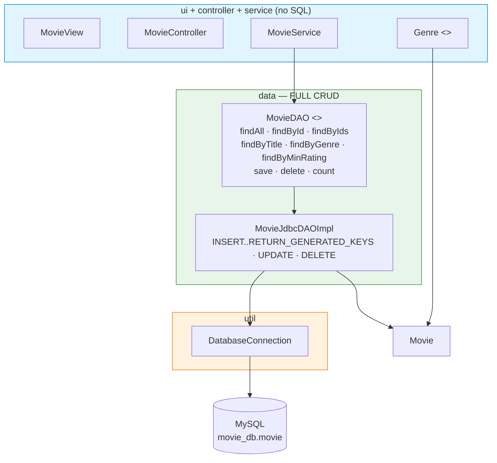
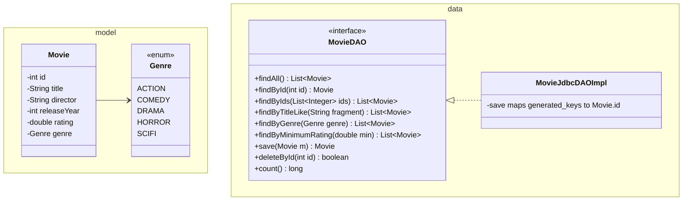

# Workshop: Movie Collection — full JDBC CRUD

> **Step 8 of 10** in the progressive series that ends with a full **Event-Manager-style application**
> (model → dao → daoImpl → service → ui → util → SQL → **full JDBC CRUD** → exceptions).

| Difficulty | Hints provided | New Event-Manager part |
|:---:|:---:|:---:|
| 8 / 10 | 5 | **Full JDBC `daoImpl` CRUD** — every operation you will ever need, in one DAO |

---

## Objective

Step 7 gave you *one* table and three methods. A real DAO is a **complete CRUD interface**:
an **`id`-based primary key**, `save`/`update`/`delete`, and a set of useful queries. By the end of
this worksheet your `MovieDAO` will be indistinguishable in shape from the Event Manager's
`ParticipantDAO` / `EventDAO`.

You also add a **`Genre` enum** (step-5 pattern) persisted as a string column — exactly how the Event
Manager stores `InvitationStatus`.

## Learning Goals

*   `INSERT`/`SELECT`/`UPDATE`/`DELETE` as `PreparedStatement`s **and** how `id` is generated
    (`Statement.RETURN_GENERATED_KEYS`).
*   Mapping enums ↔ DB values (`Genre.valueOf(rs.getString(...))` / `ps.setString(.., genre.name())`).
*   Query methods with **parameters** (`WHERE rating >= ?`, `WHERE title LIKE ?`).
*   Keeping the DAO the **only** place SQL exists (check yourself: the service/controller import SQL types).

---

## Prerequisites

*   MySQL + the `movie_db` schema applied (you are comfortable with step 7's `DatabaseConnection`).
*   Layers from steps 1–7 are assumed.
*   Commit after each task; push this branch when complete.

---

## Step 8 — Layered target



The interface has **9 methods** now — notice `findById(List<Integer> ids)` and `findByTitleLike`,
which foreshadow the relations work in step 9.

---

## Class Diagram



---

## Test Scenarios (diagram test)

| # | Scenario | Expected result |
|---|----------|-----------------|
| 1 | `save(new Movie("Inception", "Nolan", 2010, 8.8, SCIFI))` | Returned `Movie` has a real `id` (not 0) |
| 2 | `findById(savedId)` | Same movie back, same id |
| 3 | `save("Inception" again)` | `DuplicateMovieException` (service rule) — only one row in DB |
| 4 | `update(title → "Inception (2010)")` | Same `id`, new title; `findAll` reflects it |
| 5 | `findByGenre(SCIFI)` | Only SCIFI movies |
| 6 | `findByMinimumRating(8.0)` | Only rating >= 8.0 |
| 7 | `deleteById` of a movie, then `findById` | Returns null; `count()` dropped by one |
| 8 | Restart the app | All CRUD results persist (true DB, not a file) |

---

## Tasks

### Task 1 — Model + Genre enum

`Genre { ACTION, COMEDY, DRAMA, HORROR, SCIFI }`. `Movie`: `int id`, `title`/`director` (not blank),
`releaseYear` (>= 1888), `rating` (0.0–10.0), `Genre genre` (not null). The **id starts at 0** and is
filled in by `save` when the DB assigns it.

### Task 2 — Schema

`SQL_database/movie_collection.sql`:

```sql
CREATE DATABASE IF NOT EXISTS movie_db;
USE movie_db;

CREATE TABLE IF NOT EXISTS movie (
    id INT AUTO_INCREMENT PRIMARY KEY,
    title VARCHAR(200) NOT NULL,
    director VARCHAR(100) NOT NULL,
    release_year INT NOT NULL,
    rating DOUBLE NOT NULL,
    genre VARCHAR(20) NOT NULL
);
```

### Task 3 — Full CRUD interface + JDBC impl

Follow `save`'s id-returning pattern closely — **this is the signature line of the whole step**:

```java
@Override
public Movie save(Movie movie) {
    String sql = "INSERT INTO movie (title, director, release_year, rating, genre) VALUES (?, ?, ?, ?, ?)";
    try (Connection c = DatabaseConnection.getConnection();
         PreparedStatement ps = c.prepareStatement(sql, Statement.RETURN_GENERATED_KEYS)) {

        ps.setString(1, movie.getTitle());
        ps.setString(2, movie.getDirector());
        ps.setInt(3, movie.getReleaseYear());
        ps.setDouble(4, movie.getRating());
        ps.setString(5, movie.getGenre().name());
        ps.executeUpdate();

        try (ResultSet keys = ps.getGeneratedKeys()) {
            if (keys.next()) {
                movie.setId(keys.getInt(1));
            }
        }
        return movie;
    } catch (SQLException e) {
        throw new MovieStorageException("Could not save movie", e);
    }
}
```

```java
@Override
public boolean deleteById(int id) {
    String sql = "DELETE FROM movie WHERE id = ?";
    try (Connection c = DatabaseConnection.getConnection();
         PreparedStatement ps = c.prepareStatement(sql)) {
        ps.setInt(1, id);
        return ps.executeUpdate() > 0;
    } catch (SQLException e) {
        throw new MovieStorageException("Could not delete movie", e);
    }
}
```

Then the queries — every one is a `SELECT`, read into a `Movie` with a helper `toMovie(ResultSet rs)`:

*   `findByTitleLike`: `WHERE title LIKE ?` with `ps.setString(1, "%" + fragment + "%")`.
*   `findByGenre`: `WHERE genre = ?` + `Genre.valueOf(rs.getString("genre"))`.
*   `findByMinimumRating`: `WHERE rating >= ?`.
*   `count()`: `SELECT COUNT(*) AS n` → `rs.getLong("n")`.

### Task 4 — Service layer

`MovieService` wraps the DAO and adds the **rules**:

*   `save`: blank title → `IllegalArgumentException`; `findByTitle(title)` already exists →
    `DuplicateMovieException`.
*   `update(movie)`: `findById(movie.getId()) == null` → `MovieNotFoundException`.
*   The three filtered queries pass straight through.

### Task 5 — Controller + view

Menu: Add / Show all / Search by title / Show genre / Show rating>= / Update rating / Delete / Exit.
Add needs a `Genre` picker (`1 ACTION, 2 COMEDY ...`) — an **enum + menu combo you will reuse in
steps 9 and 10**.

### Task 6 — Explain

4–6 sentences: why check duplicates *twice* (service rule + `movie` table has no UNIQUE constraint
here) — and what single line in the schema would move that responsibility entirely to the DB.

---

## Hints & Help (5 hints)

1. `toMovie(ResultSet)` helper: one place that maps a row to a `Movie`; a `NumberFormatException`
   from `rs` means the column order/types don't match your `SELECT`. Name your columns in `SELECT`.
2. `update` is a full `UPDATE movie SET title=?, director=?, release_year=?, rating=?, genre=? WHERE id=?`.
   The id is the *last* `?` — easiest way to botch this is swapping value order with the WHERE clause.
3. Always `useGeneration`: without `Statement.RETURN_GENERATED_KEYS` you get a `0` id back.
4. `findByTitle` exact-match: reuse it inside `save` for the duplicate check, and give the user a real
   "movie already exists" message via your handler.
5. No wildcard worries: `LIKE` with `%...%` is case-insensitive in MySQL by default — that's a feature, not a bug.

---

## Checklist

- [ ] `Genre` enum + `Movie` with id-from-0, validation
- [ ] `movie_db` schema applied
- [ ] `save(...)` returns a Movie with generated `id`
- [ ] `findById`, `findByIds`, `findByTitleLike`, `findByGenre`, `findByMinimumRating`
- [ ] `update`, `deleteById` (returns boolean), `count`
- [ ] `MovieService` rules: duplicate + not-found exceptions
- [ ] Menu incl. Genre picker
- [ ] All 8 test scenarios pass, survives restart

## Bonus Challenge (optional)

Add `validateAll()` that loads all movies and reports the worst-rated one, and make `findByIds`
resolve a List via a single `WHERE id IN (?, ?, ...)` query built dynamically. That `IN (...)` pattern
is exactly what step 9 uses to load a participant's events.