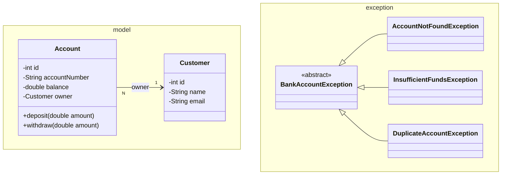

# Workshop: Bank Account — relations, transactions, one base exception

> **Step 9 of 10** in the progressive series that ends with a full **Event-Manager-style application**
> (model → dao → daoImpl → service → ui → util → SQL → JDBC → **relations + transactions**).

| Difficulty | Hints provided | New Event-Manager parts |
|:---:|:---:|:---:|
| 9 / 10 | 3 | **FK relations** + **database transactions** + a unified **base exception** — the exact machinery of `Event`↔`Participant`↔`Invitation` |

---

## Objective

Two ideas carry a money system — and the Event Manager:

1.  **Relations.** A bank account *belongs to a customer*. That's a **foreign key** stored as
    `account.owner_id`, resolved with a `JOIN`. The Event Manager's `Invitation` is the same idea
    (`participant_id` + `event_id`).
2.  **Transactions.** Withdrawing 100 from A and depositing 100 into B must happen **atomically**:
    if the second update fails, the first must be *undone*. That is `setAutoCommit(false)`/`commit()`/`rollback()`.

Sweep your exceptions under one roof too: a single abstract `BankAccountException` base
(step 4's `StudentException` is your starting point) that your handler and service can catch as a family.

## Learning Goals

*   Schema with `FOREIGN KEY` + `JOIN` in `ResultSet` mapping (`owner.name` comes out of one query).
*   `transfer()` on **one** `Connection`: `setAutoCommit(false)` → two `UPDATE`s → `commit()`, and `rollback()` in the `catch`.
*   Base-exception design: catch one type, still message per subtype.

---

## Prerequisites

*   MySQL + the `bank_db` schema applied (steps 7–8 patterns assumed).
*   All ten layers understood; only 3 hints are left — behave accordingly.
*   Commit after each task; push this branch when complete.

---

## Step 9 — Layered target

```mermaid
flowchart TD
    subgraph MODEL["model — 2 entities + relation"]
        C["Customer\nid · name · email"]
        A["Account\nid · owner_id (FK) · accountNumber · balance"]
    end

    subgraph DATA["data"]
        DAO["CustomerDAO + AccountDAO"]
        IMPL["JdbcDAOImpls\nJOIN on owner_id"]
        TX["AccountJdbcDAOImpl.transfer()\nautoCommit=false → 2×UPDATE → commit / rollback"]
    end

    subgraph EXC["exception — one family"]
        BASE["BankAccountException <<abstract>>"]
        S1["AccountNotFoundException"]
        S2["InsufficientFundsException"]
        S3["DuplicateAccountException"]
    end

    A "N" --> "1" C : belongs-to (FK)
    DAO <|.. IMPL
    DAO <|.. TX
    BASE <|-- S1
    BASE <|-- S2
    BASE <|-- S3
```

---

## Class Diagram



---

## Test Scenarios (diagram test)

| # | Scenario | Expected result |
|---|----------|-----------------|
| 1 | Create customer "Ada" + account ACC-123456 (1000) | Account's `getOwner()` is the full Customer — loaded via JOIN |
| 2 | Transfer 200 from ACC-123456 → ACC-999999 | Both balances change; total stays constant |
| 3 | Transfer 999999 from a 1000-balance account | `InsufficientFundsException`; **no balance changes at all** (rollback) |
| 4 | Kill the MySQL process *between* the two UPDATEs (debugger, `Thread.sleep`) | On restart both accounts are unchanged — the rollback worked |
| 5 | `findByAccountNumber` of a deleted/null account | `AccountNotFoundException` (supertype caught by handler) |
| 6 | Two accounts for the same customer | JOIN returns both; `customer.name` repeated — no extra query |

---

## Tasks

### Task 1 — Schema with a foreign key

```sql
CREATE DATABASE IF NOT EXISTS bank_db;
USE bank_db;

CREATE TABLE customer (
    id INT AUTO_INCREMENT PRIMARY KEY,
    name VARCHAR(100) NOT NULL,
    email VARCHAR(150) NOT NULL UNIQUE
);

CREATE TABLE account (
    id INT AUTO_INCREMENT PRIMARY KEY,
    account_number VARCHAR(20) NOT NULL UNIQUE,
    balance DOUBLE NOT NULL,
    owner_id INT NOT NULL,
    FOREIGN KEY (owner_id) REFERENCES customer(id)
);
```

### Task 2 — Models + exceptions

`Customer` (id, name, email) and `Account` (id, accountNumber matching `^ACC-\d{6}$`, balance >= 0,
`Customer owner`). `deposit`/`withdraw` **on the model** (`withdraw` throws `InsufficientFundsException`).
Make `BankAccountException` an **abstract** base; extend it with the three subtypes.

### Task 3 — Two DAOs, one JOIN

**Add-account rule:** an account needs an owner, so `save(Account)` first ensures the `Customer`
exists (save the customer, or resolve by `email`), then inserts with `owner_id`.

The JOIN — this is the line you will be reusing:

```java
String sql = """
    SELECT a.id AS account_id, a.account_number, a.balance,
           c.id AS owner_id, c.name AS owner_name, c.email AS owner_email
    FROM account a
    INNER JOIN customer c ON a.owner_id = c.id
    WHERE a.id = ?
    """;
// map: new Account(rs.getInt("account_id"), ..., new Customer(rs.getInt("owner_id"), rs.getString("owner_name"), rs.getString("owner_email")))
```

### Task 4 — The transaction: `transfer`

This is the heart of the workshop. One `Connection`, two updates, all-or-nothing:

```java
public void transfer(int fromAccountId, int toAccountId, double amount) {
    String debit  = "UPDATE account SET balance = balance - ? WHERE id = ? AND balance >= ?";
    String credit = "UPDATE account SET balance = balance + ? WHERE id = ?";

    try (Connection c = DatabaseConnection.getConnection()) {
        c.setAutoCommit(false);
        try (PreparedStatement ps1 = c.prepareStatement(debit);
             PreparedStatement ps2 = c.prepareStatement(credit)) {

            ps1.setDouble(1, amount);  ps1.setInt(2, fromAccountId);  ps1.setDouble(3, amount);
            ps2.setDouble(1, amount);  ps2.setInt(2, toAccountId);

            int debited = ps1.executeUpdate();
            if (debited == 0) {
                throw new InsufficientFundsException("Account " + fromAccountId + " has insufficient funds");
            }
            ps2.executeUpdate();
            c.commit();
        }
    } catch (SQLException | InsufficientFundsException e) {
        try (Connection c2 = DatabaseConnection.getConnection()) { c2.rollback(); } catch (SQLException ignored) { }
        throw new BankAccountException("Transfer failed", e);
    }
}
```

Note: `UPDATE ... AND balance >= ?` guards the check and the change in **one** statement — no
read-then-write race. Catch `InsufficientFundsException` separately so `amount < 0` is also rejected.

### Task 5 — Service, controller, menu

`AccountService` (transfer + deposit + withdraw + list), `AccountView`, `AccountController`,
`Main`. The handler now catches the family: `catch (BankAccountException e) → handler.handle(e)`.

### Task 6 — Explain

4–6 sentences: why is `transfer` a *single transaction* instead of two separate `UPDATE`s, and what
observable bug appears if it isn't (test scenario 4 is that bug made visible)?

---

## Hints & Help (3 hints)

1. **Rollback needs the same connection you committed from** — your rolled-back `Connection` is only
   the one from the try block. Open the connection *once*, wrap *both* statements, then commit/rollback
   it. Two separate connections steal the transaction.
2. `setAutoCommit(false)` moves MySQL from per-statement commits to your explicit `commit()`. Any
   `SELECT` inside transfer also reads **the pending state** — half-finished money is only visible
   inside the transaction until commit.
3. JOIN over two `:id`s: alias columns (`a.id AS account_id`) so the `ResultSet` never sees two `id`
   columns fighting. Your `findAll` can map accounts + customers in one pass — no second query.

---

## Checklist

- [ ] `bank_db` schema with `customer` + `account` and `FOREIGN KEY`
- [ ] `BankAccountException` abstract base + 3 subtypes
- [ ] `Account` model with `deposit`/`withdraw`
- [ ] `save(Account)` resolves owner via FK
- [ ] `transfer()` — one connection, autoCommit off, commit + rollback
- [ ] JOIN query maps owner in one `ResultSet` pass
- [ ] Menu + handler catching the base type
- [ ] All 6 test scenarios pass (test 4 proves the rollback)

## Bonus Challenge (optional)

Add a `transaction_history` table (`id, from_account_id, to_account_id, amount, created_at`) and
write the history row **inside** the same transaction. That is precisely how the Event Manager
keeps `Invitation` consistent when it references both a `Participant` and an `Event` — your step 10
will do the same.