# Workshop: Bank Account Manager

## Objective
Build a Java application to manage bank accounts stored in a text file using advanced exception handling techniques.

## Learning Goals
*   Implement the application based on the provided Class Diagram.
*   Use **Unchecked Exceptions** for data validation.
*   Create and use **Custom Checked Exceptions**.
*   Apply **Try-with-Resources** for safe File IO.
*   Implement a **Centralized Exception Handler**.

---

## Prerequisites & Submission
**Task:** Setup your environment and prepare for submission.

1.  **Create Maven Project:** Create a new Maven project in your IDE.
    *   **Group Id:** `se.lexicon`
    *   **Artifact Id:** `bank-account-workshop`
2.  **Version Control:** Initialize a Git repository for your project and push it to GitHub/GitLab.
3.  **Submission:** Share the link to your repository with your instructor once you have started or completed the workshop.

---

## Conceptual Model (Class Diagram)

The following diagram shows the relationship between the different layers of the application and how exceptions flow through them using the **MVC (Model-View-Controller)** pattern.

### Suggested Package Structure
*   **Model:** `model`
*   **Data:** `data`
*   **View:** `view`
*   **Controller:** `controller`
*   **Exception:** `exception`

```mermaid
classDiagram
    namespace model {
        class Account {
            -String ownerName
            -String accountNumber
            -double balance
            +Account(String ownerName, String accountNumber, double balance)
        }
    }

    namespace data {
        class AccountDAO {
            <<interface>>
            +findAll() List~Account~
            +save(Account account) void
            +findByAccountNumber(String accountNumber) Account
        }
        class FileAccountDAOImpl {
            -Path filePath
        }
    }

    namespace view {
        class AccountView {
            +getUserInput(String prompt) String
            +displayMenu() void
            +displayAccounts(List~Account~ accounts) void
            +displayMessage(String message) void
            +displayError(String message) void
        }
    }

    namespace controller {
        class AccountController {
            -AccountDAO accountDAO
            -AccountView accountView
            +run() void
        }
    }

    namespace exception {
        class AccountStorageException { }
        class DuplicateAccountException { }
        class InsufficientFundsException { }
        class ExceptionHandler {
            +handle(Exception e)$ void
        }
    }

    AccountDAO <|.. FileAccountDAOImpl
    AccountController --> AccountDAO : uses
    AccountController --> AccountView : updates
    AccountController ..> ExceptionHandler : delegates errors

    AccountDAO ..> Account : manages
    FileAccountDAOImpl ..> Account : persists

    Account ..> IllegalArgumentException : throws
    Account ..> InsufficientFundsException : throws
    FileAccountDAOImpl ..> AccountStorageException : throws
    FileAccountDAOImpl ..> DuplicateAccountException : throws
```

---

## 1: The Model & Validation (Unchecked)
**Task:** Create the `Account` class in the `model` package.

*   **Validation:** Validate fields in the setters and use in the constructor, throw `IllegalArgumentException` if the input is invalid (ownerName must not be blank, balance must be >= 0).
*   **Account Number Validation:** Validate the account number format using a Regular Expression (e.g., `^ACC-\\d{6}$`).

## 2: Custom Exceptions (Checked)
**Task:** Define `AccountStorageException`, `DuplicateAccountException`, and `InsufficientFundsException` in the `exception` package.

## 3: The Data Layer (DAO)
**Task:** Implement `AccountDAO` and `FileAccountDAOImpl` in the `data` package.

*   **Responsibility:** The DAO is strictly for data persistence. It should **never** print to the console. It only communicates through return values or **Exceptions**.
*   **File Format:** Each line in `accounts.txt` should be: `ownerName,accountNumber,balance`

## 4: The View & Controller (MVC)
**Task:** Create the `AccountView` (in `view` package) and `AccountController` (in `controller` package).

*   **The View:** Responsible for all user interaction (`Scanner` and `System.out`).
*   **The Controller:**
    *   Coordinates between the View and the Model.
    *   Contains the `try-catch` loop.
    *   Catches exceptions from the Model/DAO and tells the View what to display.
*   **The App/Main class:** Simply initializes the components and starts the Controller.

## 5: The MVC Design Pattern
**Task:** Explain the MVC (Model-View-Controller) design pattern.

---

## Bonus Challenge
Add **deposit and withdrawal** features with balance checks. When withdrawing, throw `InsufficientFundsException` if the withdrawal amount exceeds the current balance. After any transaction, persist the updated account to the file.
